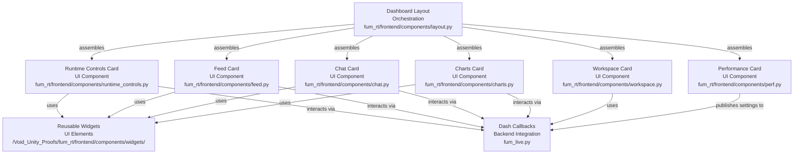
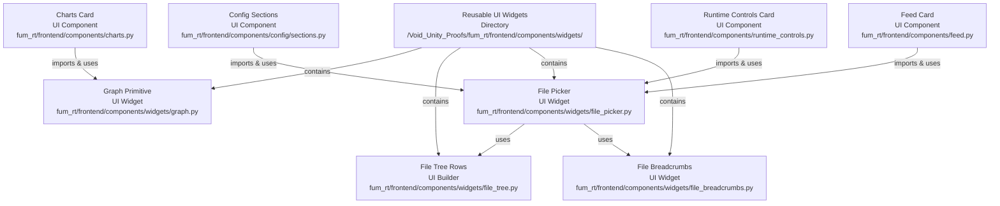

# Codebase Research Report

## Query
Investigate the "UI Components" component in detail. Focus your analysis on these key directories:
1. /Void_Unity_Proofs/fum_rt/frontend/components/
2. /Void_Unity_Proofs/fum_rt/frontend/components/widgets/
3. /Void_Unity_Proofs/fum_rt/frontend/components/config/

These directories contain 14 files related to this component. Provide insights about the component's structure across these directories, its main responsibilities and functionality, and how it integrates with other system components.

## Answer
--- fum_rt/frontend/components/perf.py ---

from __future__ import annotations

from dash import html, dcc

def perf_card():
    """
    UI Performance card (no environment variables required).
    Publishes settings into dcc.Store(id="ui-state") via callbacks/perf.register_perf_callbacks.
    """
    return html.Div(
        [
            html.H4("UI Performance"),
            html.Div(
                [
                    html.Div(
                        [
                            html.Label("Charts: HTTP snapshot only"),
                            dcc.Checklist(
                                id="ui-charts-http",
                                options=[{"label": " On", "value": "on"}],
                                value=[],  # default OFF — falls back to bounded file tails if HTTP not ready
                            ),
                        ]
                    ),
                    html.Div(
                        [
                            html.Label("Update interval (ms)"),
                            dcc.Input(id="ui-update-ms", type="number", value=800, min=250, step=50),
                        ]
                    ),
                    html.Div(
                        [
                            html.Label("Points per series cap"),
                            dcc.Input(id="ui-points-cap", type="number", value=1200, min=100, step=50),
                        ]
                    ),
                ],
                className="row",
            ),
            html.Div(
                [
                    html.Div(
                        [
                            html.Label("Series count cap"),
                            dcc.Input(id="ui-series-cap", type="number", value=6, min=1, step=1),
                        ]
                    ),
                    html.Div(
                        [
                            html.Label("Status URL"),
                            dcc.Input(
                                id="ui-status-url",
                                type="text",
                                value="http://127.0.0.1:8787/status/snapshot",
                                style={"width": "100%"},
                            ),
                        ]
                    ),
                    html.Div(
                        [
                            html.Label("Status timeout (s)"),
                            dcc.Input(id="ui-status-timeout", type="number", value=0.2, min=0.05, step=0.05),
                        ]
                    ),
                ],
                className="row",
            ),
            html.Div(
                [
                    html.Div(
                        [
                            html.Label("Tail Chat file"),
                            dcc.Checklist(id="ui-tail-chat", options=[{"label": " On", "value": "on"}], value=[]),
                        ]
                    ),
                    html.Div(
                        [
                            html.Label("Tail Launcher log"),
                            dcc.Checklist(id="ui-tail-launch", options=[{"label": " On", "value": "on"}], value=[]),
                        ]
                    ),
                ],
                className="row",
            ),
            html.Small(
                "Settings apply immediately; no env vars or restart required.",
                style={"color": "#8699ac"},
            ),
        ],
        className="card",
    )

__all__ = ["perf_card"]
# UI Components Overview

The `UI Components` within the `/Void_Unity_Proofs/fum_rt/frontend/components/` directory serve as the foundational building blocks for the FUM Live Dashboard's user interface. This component is designed to provide a modular and organized approach to constructing the various interactive elements and display panels of the application. It encapsulates distinct UI functionalities into reusable units, promoting maintainability and clarity in the frontend architecture.

The component's structure is organized into three key sub-directories, each with a specialized role:
*   **`/Void_Unity_Proofs/fum_rt/frontend/components/`**: Contains the primary, application-specific UI "cards" that form the main sections of the dashboard.
*   **`/Void_Unity_Proofs/fum_rt/frontend/components/widgets/`**: Houses generic, reusable UI elements or "widgets" that can be composed to build more complex components.
*   **`/Void_Unity_Proofs/fum_rt/frontend/components/config/`**: Dedicated to UI elements related to application configuration and process control.

These components collectively define the visual and interactive aspects of the FUM Live Dashboard, integrating with backend logic (likely via `fum_live.py` callbacks) to display data, accept user input, and control simulation runs.

## Core UI Cards: `/Void_Unity_Proofs/fum_rt/frontend/components/`

This directory contains the main "card" components that represent distinct functional areas of the FUM Live Dashboard. Each file typically defines a single, self-contained UI panel.

### Main Responsibilities and Functionality

These components are responsible for rendering specific sections of the dashboard, often containing input fields, display areas, and action buttons. They are designed to be integrated into a larger layout, orchestrated by [layout.py](fum_rt/frontend/components/layout.py).

*   **Charts Card**: Defined in [charts.py](fum_rt/frontend/components/charts.py), this component displays graphical representations of data, utilizing primitive graph widgets. Its primary responsibility is data visualization.
*   **Chat Card**: Implemented in [chat.py](fum_rt/frontend/components/chat.py), this card provides a chat-like interface for logging outputs, filtering messages, and sending commands. It includes a log view, filter options, and an input/send mechanism.
*   **Feed Card**: Located in [feed.py](fum_rt/frontend/components/feed.py), this component manages the feeding of input data (stdin) to the application. It includes a file picker for selecting feed files and controls for starting/stopping the feed.
*   **Layout Orchestration**: The [layout.py](fum_rt/frontend/components/layout.py) file is crucial as it constructs the entire dashboard layout by assembling instances of other card components. It acts as the top-level container for the UI.
*   **Performance Card**: Defined in [perf.py](fum_rt/frontend/components/perf.py), this card allows users to configure UI performance settings, such as update intervals, data caps for charts, and status URL.
*   **Runtime Controls Card**: Found in [runtime_controls.py](fum_rt/frontend/components/runtime_controls.py), this component provides controls for tuning runtime parameters of the simulation, such as phase, speak parameters, walkers, hops, and the ability to load engrams.
*   **Workspace Card**: Implemented in [workspace.py](fum_rt/frontend/components/workspace.py), this card manages the selection and refreshing of simulation run directories, allowing users to choose which run's data to interact with.

### Integration with Other System Components

These core UI cards are primarily integrated with the main application logic (e.g., `fum_live.py`) through Dash callbacks. Their internal element IDs are explicitly preserved to ensure compatibility with existing callback functions that handle user interactions and data updates. They also compose smaller widgets from the `widgets/` directory.

## Reusable UI Widgets: `/Void_Unity_Proofs/fum_rt/frontend/components/widgets/`

This directory contains smaller, more generic UI elements that are designed for reusability across different components. They serve as fundamental building blocks for constructing more complex interfaces.

### Main Responsibilities and Functionality

These widgets provide common UI patterns and functionalities, abstracting away their internal implementation details.

*   **File Breadcrumbs**: Defined in [file_breadcrumbs.py](fum_rt/frontend/components/widgets/file_breadcrumbs.py), this widget provides a navigational breadcrumb trail for file paths, typically used within file selection interfaces.
*   **File Picker**: Implemented in [file_picker.py](fum_rt/frontend/components/widgets/file_picker.py), this is a comprehensive, reusable component for selecting files. It features a compact display, a modal overlay with a navigable file tree, and bounded I/O for efficient directory listing. It is a key component for any file selection needs.
*   **File Tree Rows**: The [file_tree.py](fum_rt/frontend/components/widgets/file_tree.py) module provides UI builders for individual directory and file rows within a file tree structure, used by the file picker.
*   **Graph Primitive**: Located in [graph.py](fum_rt/frontend/components/widgets/graph.py), this is a simple wrapper for `dcc.Graph`, serving as a basic building block for displaying charts.

### Integration with Other System Components

Widgets are integrated by being imported and utilized within the larger UI cards in the parent `components/` directory. For example, the [file_picker](fum_rt/frontend/components/widgets/file_picker.py) is used by the [feed_card](fum_rt/frontend/components/feed.py) and [runtime_controls_card](fum_rt/frontend/components/runtime_controls.py), as well as within the configuration sections. The [graph](fum_rt/frontend/components/widgets/graph.py) widget is used by the [charts_card](fum_rt/frontend/components/charts.py).

## Configuration UI: `/Void_Unity_Proofs/fum_rt/frontend/components/config/`

```mermaid
graph TB
  configDir["Configuration UI<br>Directory<br>/Void_Unity_Proofs/fum_rt/frontend/components/config/"]
  initFile["__init__.py<br>Package Initializer<br>fum_rt/frontend/components/config/__init__.py"]
  runConfigCard["Run Configuration Card<br>UI Component<br>fum_rt/frontend/components/config/run_config.py"]
  sectionsFile["Modular Sections<br>UI Components<br>fum_rt/frontend/components/config/sections.py"]
  dashboardLayout["Dashboard Layout<br>Orchestration<br>fum_rt/frontend/components/layout.py"]
  dashCallbacks["Dash Callbacks<br>Backend Integration<br>fum_live.py"]
  filePicker["File Picker<br>UI Widget<br>fum_rt/frontend/components/widgets/file_picker.py"]

  configDir --> |"contains"| initFile
  configDir --> |"contains"| runConfigCard
  configDir --> |"contains"| sectionsFile

  initFile --> |"exports"| runConfigCard
  initFile --> |"exports"| sectionsFile

  runConfigCard --> |"assembles"| sectionsFile

  sectionsFile --> |"defines"| coreParams["Core Parameters<br>Config Section<br>fum_rt/frontend/components/config/sections.py"]
  sectionsFile --> |"defines"| modes["Modes<br>Config Section<br>fum_rt/frontend/components/config/sections.py"]
  sectionsFile --> |"defines"| structureTraversal["Structure & Traversal<br>Config Section<br>fum_rt/frontend/components/config/sections.py"]
  sectionsFile --> |"defines"| stimulus["Stimulus<br>Config Section<br>fum_rt/frontend/components/config/sections.py"]
  sectionsFile --> |"defines"| speakB1["Speak / B1 Spike Detector<br>Config Section<br>fum_rt/frontend/components/config/sections.py"]
  sectionsFile --> |"defines"| vizLogsCheckpoints["Viz / Logs / Checkpoints<br>Config Section<br>fum_rt/frontend/components/config/sections.py"]
  sectionsFile --> |"defines"| profileIO["Profile I/O<br>Config Section<br>fum_rt/frontend/components/config/sections.py"]
  sectionsFile --> |"defines"| processActions["Process Actions<br>Config Section<br>fum_rt/frontend/components/config/sections.py"]

  dashboardLayout --> |"integrates"| runConfigCard
  runConfigCard --> |"relies on"| dashCallbacks
  sectionsFile --> |"uses"| filePicker
  sectionsFile --> |"uses"| dashCallbacks
```

This directory is specifically dedicated to UI components that manage the application's run configuration and process actions. It modularizes the complex configuration interface into manageable sections.

### Main Responsibilities and Functionality

The components here are responsible for presenting and allowing modification of various simulation parameters and controlling the execution of runs.

*   **Initialization**: The [__init__.py](fum_rt/frontend/components/config/__init__.py) file serves as the package initializer, exporting the `run_config_card` and its modular sections for external use.
*   **Run Configuration Card**: Defined in [run_config.py](fum_rt/frontend/components/config/run_config.py), this is the main component for assembling the entire run configuration and process control interface. It acts as a container for various configuration sections.
*   **Modular Sections**: The [sections.py](fum_rt/frontend/components/config/sections.py) file breaks down the comprehensive run configuration into smaller, thematic sections. These sections include:
    *   **Core Parameters**: For fundamental settings like neurons, k, and Hz.
    *   **Modes**: For toggling simulation modes like time dynamics and sparse mode.
    *   **Structure & Traversal**: For parameters related to the simulation's internal structure and traversal algorithms.
    *   **Stimulus**: For configuring input stimulus parameters.
    *   **Speak / B1 Spike Detector**: For settings related to the application's "speak" functionality and spike detection.
    *   **Viz / Logs / Checkpoints**: For controlling visualization frequency, logging, and checkpointing.
    *   **Profile I/O**: For saving and loading run profiles, including integration with the [file_picker](fum_rt/frontend/components/widgets/file_picker.py).
    *   **Process Actions**: For initiating, resuming, or stopping simulation runs.

### Integration with Other System Components

The configuration components are integrated into the overall dashboard layout via [layout.py](fum_rt/frontend/components/layout.py). They rely heavily on Dash callbacks (implied to be in `fum_live.py`) to handle user input, update configuration values, and trigger backend processes. The `sections.py` module utilizes basic input widgets (`dcc.Input`, `dcc.Checklist`, `dcc.Dropdown`) and the [file_picker](fum_rt/frontend/components/widgets/file_picker.py) widget to construct its detailed UI.

---
*Generated by [CodeViz.ai](https://codeviz.ai) on 8/26/2025, 6:09:57 PM*
