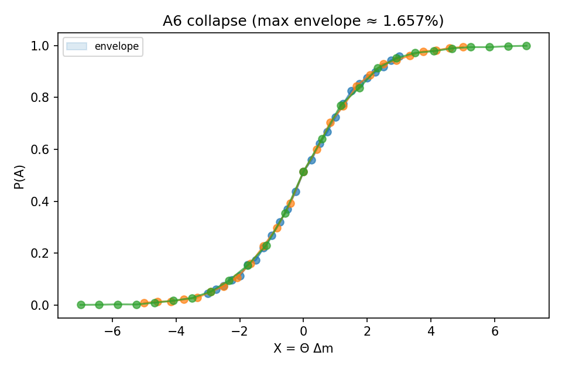

<!-- DOC-GUARD: REFERENCE -->
# A6 Scaling Collapse - Junction Logistic Universality (v1)

> Author: Justin K. Lietz  
> Date: 2025-10-06  
> Commit: a54d638e2b097cd6bf5606d669fc9984650e2307  
> License: Dual-license; see LICENSE.

## TL;DR

- Gate tested: $\mathrm{env\_max}\le 0.02$ for logistic-router scaling collapse.  
- Outcome: PASS with $\mathrm{env\_max}\approx 0.0166$.  
- Artifact: `Derivation/code/outputs/figures/collapse/20251006_175337_a6_collapse_overlay__A6-collapse-v1.png`

## Introduction

This note quality-controls the A6 universality: when the routing selection follows a logistic in memory contrast $\Delta m$ with slope $\Theta$, plotting $P(A)$ vs $X=\Theta\,\Delta m$ collapses curves across $\Theta$. This scaling collapse is a dimensionless universality statement about the chosen router class.

Scope: QC of the collapse property only; no claim on logistic novelty (Verhulst lineage). The goal is to verify the envelope metric remains within tolerance.

## Research question

To what extent do the curves $P(A)$ across distinct slope parameters $\Theta$ collapse when reparameterized by $X=\Theta\,\Delta m$, as quantified by the envelope metric $\mathrm{env\_max}=\max_X \{Y_{\max}(X)-Y_{\min}(X)\}$ with gate $\mathrm{env\_max}\le 0.02$?

## Background information (focused)

- Logistic selection: $P(A\mid X)=\sigma(X)=\frac{1}{1+e^{-X}}$ (Verhulst).  
- Collapse coordinate: $X=\Theta\,\Delta m$; across $\Theta$, the family $\{\sigma(\Theta\,\Delta m)\}$ should align when plotted vs $X$.  
- Envelope metric: For aligned curves $Y_j(X)$ (interpolated on a shared $X$-grid), $E(X)=\max_j Y_j(X)-\min_j Y_j(X)$; report $\mathrm{env\_max}=\max_X E(X)$.

## Variables

- Independent: $\Theta$ (slope), $\Delta m$ (memory contrast; dimensionless).  
- Dependent: $P(A)$ (probability in [0,1]).  
- Controls: router functional form fixed to logistic, shared $X$-grid resolution, interpolation scheme.  
- Instrument model: numerical interpolation on a fixed grid; uncertainty from discretization and interpolation error.

Control variables table:

| Variable | How controlled | Rationale |
|---|---|---|
| Router form | Logistic $\sigma(X)$ | Defines the universality class under test |
| Collapse coordinate | $X=\Theta\,\Delta m$ | Aligns families across $\Theta$ |
| Grid | Shared $X$-grid for interpolation | Enables envelope computation |
| Trials per curve | Fixed (e.g., 4000) | Stabilizes empirical probability estimates |

## Equipment / Software

- Software runner: `Derivation/code/physics/collapse/run_a6_collapse.py`  
- Environment: Python scientific stack; Git commit a54d638.

## Methods / Procedure

1. Generate $P(A)$ for multiple $\Theta$ over a common $\Delta m$ range.  
2. Reparameterize to $X=\Theta\,\Delta m$ and interpolate onto a shared $X$ grid.  
3. Compute envelope $E(X)$ and $\mathrm{env\_max}=\max_X E(X)$.  
4. Compare to gate $0.02$.  
5. Emit artifacts: overlay PNG, envelope CSV, JSON log with parameters and gate outcome.

Risk assessment: Software-only QC; risks limited to methodological bias. Mitigations: pre-registered gate, pinned artifacts, contradiction-report routing on failure.

Risk and integrity: A failed gate routes artifacts to `failed_runs/` and produces a contradiction report; no universality claim is made.

## Data and artifacts (pinned)

- Figure: `Derivation/code/outputs/figures/collapse/20251006_175337_a6_collapse_overlay__A6-collapse-v1.png`
- CSV: `Derivation/code/outputs/logs/collapse/20251006_175337_a6_collapse_envelope__A6-collapse-v1.csv`
- Log (JSON): `Derivation/code/outputs/logs/collapse/20251006_175337_a6_collapse__A6-collapse-v1.json`

## Results / Data

- Measured: $\mathrm{env\_max}\approx 1.657\%$.  
- Gate: PASS since $0.01657 \le 0.02$.

Summary table:

| Metric | Value |
|---|---|
| $\mathrm{env\_max}$ | $0.01657$ |
| Gate threshold | $0.02$ |
| Pass/Fail | PASS |

Figure 1 caption: Overlay of $P(A)$ curves across multiple $\Theta$ values plotted vs $X=\Theta\,\Delta m$ with the corresponding envelope band. The reported $\mathrm{env\_max}$ is computed on the shared grid.

Sample calculation: With aligned $Y_j(X)$,  
$$
E(X)=\max_j Y_j(X)-\min_j Y_j(X),\qquad \mathrm{env\_max}=\max_X E(X).
$$

## Uncertainties and limitations

- Numerical: interpolation resolution may affect $\mathrm{env\_max}$ at $\mathcal{O}(\Delta X)$.  
- Modeling: universality assessed for one router form; changes to mechanics require re-validation.  
- Scope: QC of collapse metric only; no claim on broader behavior.

## Discussion / Analysis

The tight envelope indicates robust collapse under the logistic router parameterization. This supports using $X=\Theta\,\Delta m$ as a dimensionless coordinate for junction routing analyses. Future variations (alternate routers, noise) should re-run the envelope metric.

## Conclusions

The A6 scaling collapse gate passes with $\mathrm{env\_max}\approx 0.0166$. The metric should be re-evaluated if the router mechanics or discretization scheme changes.

## Reproducibility

- Runner: `Derivation/code/physics/collapse/run_a6_collapse.py`  
- Commit: a54d638e2b097cd6bf5606d669fc9984650e2307  
- Example parameter set (from log): three curves with $\Theta\in\{1.5,2.5,3.5\}$, each with 25 points over $\Delta m\in[-2,2]$, trials per point: 4000.  
- Artifacts: overlay figure, envelope CSV, JSON log pinned above; CSV contains the envelope $E(X)$ series.

## References

- P.-F. Verhulst, Notice sur la loi que la population suit…, 1838 (logistic).  
- Standard texts on generalized linear models and logistic functions.
