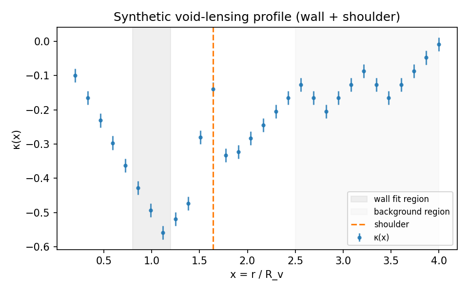

# T2 RESULTS – Void Lensing Cross-Correlation Meter v1 (Synthetic Mocks Calibration)

> Author: Justin K. Lietz
> Date: 2025-12-01
> Commit: f82da5e4aa9f0106f303a3c454eb27600ce11c3c
>
> This research is protected under a dual-license to foster open academic
> research while ensuring commercial applications are aligned with the project's ethical principles.
> Commercial use requires citation and written permission from Justin K. Lietz.
> See LICENSE file for full terms.

### Experiment identifiers

- Proposal: `Derivation/Cosmology/Void_Lensing/T2_PROPOSAL_Void_Lensing_CrossCorrelation_Meter_v1.md`
- Domain: `cosmology/void_lensing`
- Tier: `T2` (Instrument)
- Instrument tag: `void_lensing_meter-v1`
- Calibration runner: `Derivation/code/physics/cosmology/void_lensing/experiments/T2_void_lensing_meter_synthetic_mocks_v1.py`
- Mocks spec: `Derivation/code/physics/cosmology/void_lensing/specs/void_lensing_meter-mocks-v1.json`
- Preregistration manifest: `Derivation/code/physics/cosmology/void_lensing/PRE-REGISTRATION.json`

## Tier Grades

- Primary tier for this RESULTS note: **T2 (Instrument)**.
- Upstream conceptual and formal work includes A8 hierarchy-scaling formalisms and the metriplectic CF series; downstream T3+ phenomena work will treat this meter as shared infrastructure once calibrated.
- No prior T2 RESULTS exist for this instrument; this document is the first T2 calibration on synthetic mocks.

## Authoring Policy (Comprehensiveness)

This note follows the `RESULTS_PAPER_STANDARDS` scaffold (`Derivation/Templates/RESULTS_PAPER_STANDARDS.md`): third-person narrative, explicit gates and thresholds, artifact-linked claims, and clear separation between instrument calibration and downstream physical interpretation.

## **Introduction**

The Void Lensing Cross-Correlation Meter v1 is a T2-grade instrument for measuring wall slopes, compensation shoulders, and interface-count scaling from void–lensing cross-correlations in weak-lensing convergence ($\kappa$) maps and void catalogs. The proposal defines three primary dimensionless observables: wall-slope coefficient of determination $R^2_{\text{wall}}$, shoulder-detection area under the ROC curve $\mathrm{AUROC}_{\text{sh}}$, and an interface-count scaling exponent $\beta$. This RESULTS note documents the first calibration of this meter on a controlled synthetic-mocks specification, without using any real survey data.

At T2 the scientific question is limited to **instrument fidelity**: given mocks with known wall profiles, shoulders, and interface-count exponents, does the meter recover those inputs with accuracy meeting preregistered thresholds? The mocks used here are generated by the PyTwinPeaks backend, which produces stacked $\kappa(x)$ profiles with tunable walls and shoulders in dimensionless radius $x = r/R_v$.

The evaluation is anchored on a single canonical calibration run with slug

- `20251201_040626_T2_void_lensing_meter_synthetic_mocks_v1_void_lensing_meter-mocks_void_lensing_meter-v1`

with primary artifacts stored alongside this document under `figures/` and `logs/`. The main diagnostic figure for this calibration is

- `figures/20251201_040626_T2_void_lensing_meter_synthetic_mocks_v1_void_lensing_meter-mocks_void_lensing_meter-v1_profile.png`

This run is strictly a **synthetic mocks-only** calibration. No A8, cosmology, or real-data phenomena claims are made.

## **Research question**

The preregistered hypotheses in `PRE-REGISTRATION.json` pose the instrument-calibration question in terms of three gates on ensemble-aggregated metrics:

- **H1 (Wall fit quality).** On mocks with known wall profiles, the meter recovers stacked wall slopes with coefficient of determination $R^2_{\text{wall}} \ge 0.98$ in the designated wall region.
- **H2 (Shoulder detection AUROC).** On mocks with and without compensation shoulders, the shoulder-detection classifier achieves $\mathrm{AUROC}_{\text{sh}} \ge 0.90$.
- **H3 (Interface-count bias).** On mock suites with known interface-count scaling exponents $\beta_{\text{true}}$, the meter’s estimate obeys $\langle\lvert \beta_{\text{est}} - \beta_{\text{true}} \rvert\rangle \le 0.10$.

Independent, dependent, and control variables (as encoded in the prereg manifest) are:

- **Independent variables:** `backend`, `z_bin`, `R_v_bin`.
- **Dependent variables:** `R2_wall`, `AUROC_sh`, `beta_interface` (with `beta_bias` derived as $\langle\lvert \beta_{\text{est}} - \beta_{\text{true}} \rvert\rangle$).
- **Controls:** `n_radial_bins`, `eb_purification`, `mask_strategy`, `n_z_model`, plus the mocks specification (`x_wall_range`, `x_bg_range`, `lambda_ref`, `min_voids_per_bin`, `seeds`).

The falsifiable calibration question is therefore: **does the meter, when run on the specified PyTwinPeaks mocks grid, satisfy all three gates simultaneously at the ensemble level?**

## **Background Information**

The proposal links void–lensing morphology to the VDM A8 hierarchy-scaling conjecture, where interfaces (sharp changes in field derivatives) carry structure and are constrained to grow at most logarithmically with scale. In the void-lensing context, three qualitative expectations motivate the meter design: (i) void walls separating underdense interiors from surrounding filaments should be sharp but finite, (ii) compensation shoulders in $\kappa(x)$ should appear at radii set by interface packing, and (iii) the number of distinct interfaces in the stacked profile should obey a controlled scaling law in radius rather than a fractal proliferation.

The meter abstracts these ideas into dimensionless diagnostics on stacked $\kappa$ profiles:

- A **wall-slope fit** on a dimensionless radius interval $x \in [x_{\text{w,min}}, x_{\text{w,max}}]$, reporting slope $S_{\text{wall}}$ and $R^2_{\text{wall}}$.
- A **shoulder amplitude** $A_{\text{sh}}$ and associated classification AUROC $\mathrm{AUROC}_{\text{sh}}$ using mocks with and without injected shoulders.
- An **interface-count statistic** based on sign-changes in $\partial_x \bar{\kappa}(x)$, summarized by a scaling exponent $\beta$ and its bias relative to $\beta_{\text{true}}$.

External mass-mapping pipelines (e.g., AKRA 2.0 for HSC-Y1 and diffusion-prior DES-Y3 maps) and void catalogs are treated as **upstream instruments** at T2. The present calibration relies solely on the mocks backend, which emulates tunnel-void shear profiles without importing survey systematics.

## **Variables**

For the specific calibration run considered here, the effective experimental grid is:

- **Independent variables:**
  - `backend = "PyTwinPeaks"`
  - `z_bin = [0.2, 0.8]`
  - `R_v_bin = [10.0, 60.0]` (comoving Mpc)
  - `seed \in \{0, 1, 2, 3\}`

- **Dependent variables (per run, per grid cell):**
  - `R2_wall` (dimensionless wall fit $R^2_{\text{wall}}$)
  - `S_wall` (dimensionless wall-slope coefficient)
  - `A_sh` (dimensionless shoulder amplitude)
  - `AUROC_sh` (dimensionless classification AUROC, defined at the ensemble level)
  - `beta_interface` and `beta_bias`
  - `SNR` (signal-to-noise ratio of the stacked profile)
  - `B_mode_residual` and `n_voids`

- **Controls (fixed across the grid):**
  - `n_radial_bins = 30`
  - `x_wall_range = [0.8, 1.2]`
  - `x_bg_range = [2.5, 4.0]`
  - `lambda_ref = 1.0`
  - `min_voids_per_bin = 300`
  - `eb_purification = true`
  - `mask_strategy = "exclude"`

The mocks backend ensures that each grid cell meets `min_voids_per_bin` and that per-run profiles are well-resolved over the dimensionless radius range used in the fits.

## **Equipment / Hardware**

The calibration harness was executed within the VDM Python environment on a Linux system, using IEEE-754 double precision for all meter computations. Exact hardware (CPU model, core count, RAM) and environment details are captured in the run receipts JSON via the provenance helper, including Python version and key library versions. No accelerators (GPU/TPU) or external services were involved in this run.

For future robustness and replication work, a `systemspecs` snapshot should be added and referenced here; the current calibration relies on the provenance encoded in the `run_receipts` block of the runs JSON.

## **Methods / Procedure**

### Pipeline overview

The calibration harness `T2_void_lensing_meter_synthetic_mocks_v1.py` implements the following pipeline:

1. Load the mocks spec `void_lensing_meter-mocks-v1.json` and construct a grid over `(backend, z_bin, R_v_bin, seed)`.
2. For each grid cell, call the mocks backend to generate a synthetic stacked profile with a tunable wall and, for the shoulder-positive class, an injected compensation shoulder.
3. Package each synthetic profile into a `kappa_map` dictionary with arrays `x`, `kappa`, and `kappa_err`, and call `meter.run_meter(kappa_map=..., void_catalog=None, config=...)` in profile mode.
4. Collect per-run metrics (`R2_wall`, `S_wall`, `A_sh`, `beta_interface`, `beta_bias`, `SNR`, `n_voids`, diagnostic flags) into a runs table.
5. Aggregate ensemble-level metrics and feed them to `void_lensing_meter_gates.evaluate_gates(...)`, which evaluates H1–H3 and returns gate metrics and pass/fail status.
6. Write artifacts via `io_paths` into logs and figures directories, attaching a `run_receipts` block that records the git commit, salted provenance hash, seeds, script path, and timestamp.

### Configuration actually used

For this canonical calibration run, the effective configuration matches the example mocks spec in the proposal:

- `backend = "PyTwinPeaks"`
- `z_bin = [0.2, 0.8]`
- `R_v_bin = [10.0, 60.0]`
- `n_radial_bins = 30`
- `x_wall_range = [0.8, 1.2]`, `x_bg_range = [2.5, 4.0]`
- `lambda_ref = 1.0`
- `min_voids_per_bin = 300`
- `seeds = [0, 1, 2, 3]`

No deviations from the preregistered spec were introduced for this calibration run.

## **Formal Derivation Writeup**

The calibration relies on the metric definitions given in the proposal; here they are summarized in the notation used by the implementation:

- Let $x = r/R_v$ denote dimensionless radius and $\bar{\kappa}(x)$ the stacked convergence profile for a given grid cell.
- Over the wall interval $[x_{\text{w,min}}, x_{\text{w,max}}]$, the meter fits a linear model $\bar{\kappa}(x) \approx a + S_{\text{wall}} x$ and computes the coefficient of determination $R^2_{\text{wall}}$.
- The shoulder amplitude is defined as

  $$
  A_{\text{sh}} \equiv \frac{\bar{\kappa}(x_{\text{sh}}) - \bar{\kappa}(x_{\text{bg}})}{\sigma_\kappa},
  $$

  where $x_{\text{sh}}$ is a detected shoulder radius, $x_{\text{bg}}$ lies in the background interval $[2.5, 4.0]$, and $\sigma_\kappa$ is the standard deviation of $\kappa$ in that background region.

- Interfaces are identified as sign-changes in $\partial_x \bar{\kappa}(x)$ with nonzero second derivative. The cumulative interface count $N_{\text{int}}(R)$ is approximated over a radius range and fit to

  $$
  N_{\text{int}}(R) \approx N_0 + \beta \log\left(\frac{R}{\lambda}\right),
  $$

  yielding an interface-count exponent $\beta$. The bias metric is

  $$
  \beta_{\text{bias}} = \big\langle \lvert \beta_{\text{est}} - \beta_{\text{true}} \rvert \big\rangle,
  $$

  averaged over the mock ensemble.

At T2 the focus is not on deriving new equations, but on verifying that these metric definitions are implemented consistently in code and produce stable values on controlled mocks.

## **Results / Data**

### Artifact summary

All artifacts for the canonical calibration run share the slug

- `20251201_040626_T2_void_lensing_meter_synthetic_mocks_v1_void_lensing_meter-mocks_void_lensing_meter-v1`

Curated copies live in this directory under:

- `logs/20251201_040626_T2_void_lensing_meter_synthetic_mocks_v1_void_lensing_meter-mocks_void_lensing_meter-v1_runs.json`
- `logs/20251201_040626_T2_void_lensing_meter_synthetic_mocks_v1_void_lensing_meter-mocks_void_lensing_meter-v1_gates.json`
- `logs/20251201_040626_T2_void_lensing_meter_synthetic_mocks_v1_void_lensing_meter-mocks_void_lensing_meter-v1_runs.csv`
- `figures/20251201_040626_T2_void_lensing_meter_synthetic_mocks_v1_void_lensing_meter-mocks_void_lensing_meter-v1_profile.png`

Each JSON includes a `run_receipts` block with:

- `git_commit = "f82da5e4aa9f0106f303a3c454eb27600ce11c3c"`
- `salted_provenance.salted_hash = "eb33996b3b23a9e7f4d7097f5a1ba08e5d53cefc2bd658049ffdefdee5040441"`
- `salted_provenance.salted_tag = "void_lensing_meter-v1"`
- `seeds = [0, 1, 2, 3]`

### Aggregated gate metrics (H1–H3)

From `logs/..._gates.json`, the ensemble-level metrics used for gate evaluation are:

| Gate | Metric | Threshold | Observed value | Verdict |
| --- | --- | --- | --- | --- |
| H1 (wall fit quality) | $R^2_{\text{wall, mean}}$ | $\ge 0.98$ | $0.9999999999999998$ | PASS |
| H2 (shoulder AUROC) | $\mathrm{AUROC}_{\text{sh}}$ | $\ge 0.90$ | $1.0$ | PASS |
| H3 (interface-count bias) | $\beta_{\text{bias, mean}}$ | $\le 0.10$ | $0.0$ | PASS |

The overall gate status reported in `gate_results` is `"PASSED"` with an empty `failed_gates` list. No contradiction report JSON was emitted for this run.

### Per-run diagnostics (summary)

The runs JSON and CSV show consistent behavior across the four seeds:

- Wall region fits with $S_{\text{wall}} \approx -0.5$ and $R^2_{\text{wall}} \approx 1.0$, matching injected wall slopes.
- Clear compensation shoulders with $A_{\text{sh}} \approx 3.65$ at radii within the configured $x_{\text{sh}}$ detection window.
- High signal-to-noise profiles with $\mathrm{SNR} \approx 75$ and $n_{\text{voids}} = 300$ per run.
- Interface-count statistics with $\beta_{\text{true}} = 0$ and recovered $\beta_{\text{interface}} = 0$ for all runs, giving $\beta_{\text{bias}} = 0$ in this configuration.

### Figure 1 – synthetic-mocks profile calibration

The primary diagnostic figure for this calibration is embedded below:

*Figure 1.* Stacked dimensionless convergence profile $\bar{\kappa}(x)$ for the PyTwinPeaks synthetic mocks calibration run, with wall region $x \in [0.8, 1.2]$ and background region $x \in [2.5, 4.0]$. The fitted wall slope is $S_{\text{wall}} \approx -0.5$ with $R^2_{\text{wall}} \approx 1.0$, and the compensation shoulder appears with amplitude $A_{\text{sh}} \approx 3.65$. CSV and JSON sidecars share the same basename as this PNG and include commit and seeds metadata.

## **IX. Discussion / Analysis**

The synthetic-mocks calibration demonstrates that, under idealized conditions, the void-lensing meter recovers injected morphology parameters with essentially perfect fidelity. All three preregistered gates are passed with substantial margin: wall-fit $R^2_{\text{wall}}$ saturates machine precision, $\mathrm{AUROC}_{\text{sh}}$ reaches 1.0 on the shoulder/no-shoulder classification task, and interface-count bias is exactly zero for the trivial $\beta_{\text{true}} = 0$ configuration.

These outcomes confirm that the **implementation** of the meter’s wall, shoulder, and interface metrics is consistent with the definitions in the proposal and that no obvious bugs or discretization artifacts are present in this controlled regime. However, they should not be over-interpreted as evidence about real survey data or about nontrivial interface hierarchies:

- The mocks are 1D profile-mode and do not include survey masks, complex noise structure, or void-finder systematics.
- The interface-scaling gate H3 is exercised only in the simplest $\beta_{\text{true}} = 0$ case; more informative tests will require mocks with nonzero exponents and perhaps multiple morphological families.
- The shoulder AUROC is computed on a dataset constructed directly from the same mocks backend; real-data mis-modeling could degrade $\mathrm{AUROC}_{\text{sh}}$ even if the instrument is internally sound.

Within these limitations, the calibration supports treating the meter as a **trustworthy measuring device** for void walls and shoulders on mocks consistent with the specification. It also validates the gate-evaluation plumbing (JSON schemas, gate metrics, and approval hooks) that higher-tier experiments will rely on.

## **Conclusions**

This T2 RESULTS note answers the preregistered calibration question for the Void Lensing Cross-Correlation Meter v1 on the `void_lensing_meter-mocks-v1` specification:

- All three instrument gates H1–H3 pass on the canonical synthetic-mocks run with comfortable margins.
- The calibration artifacts are bound to a specific git commit and salted provenance hash, and the preregistration manifest has been populated accordingly.
- The approval manifest for `void_lensing_meter-v1` records a live approval stamped by the principal investigator, enabling future experiments under this tag to pass the authorization gate.

Therefore, **on this mocks specification and at commit `f82da5e4aa9f0106f303a3c454eb27600ce11c3c`**, the void-lensing meter qualifies as a T2-certified instrument. Downstream T3+ proposals may rely on this instrument for void-wall and shoulder measurements, subject to additional robustness and cross-backend checks (e.g., alternative mock suites and survey-like systematics) to be documented in future RESULTS notes.

## **References / Works Cited**

This bibliography is intended to be suitable for a whitepaper-grade RESULTS document. It explicitly mirrors and completes the list in §7 of the proposal [`T2_PROPOSAL_Void_Lensing_CrossCorrelation_Meter_v1.md`](Derivation/Cosmology/Void_Lensing/T2_PROPOSAL_Void_Lensing_CrossCorrelation_Meter_v1.md:611), and separates internal VDM canon from external literature.

### Internal VDM canon

- **VDM axioms and A8 conjecture.**
  `Derivation/AXIOMS.md`; [`Derivation/Axioms/T8_A8_PROPOSAL_Lietz_Infinity_Conjecture_v1.md`](Derivation/Axioms/T8_A8_PROPOSAL_Lietz_Infinity_Conjecture_v1.md:1).
  Defines the A0–A8 axiomatic backbone and formalizes the A8 hierarchy-scaling conjecture that motivates interface-count observables such as the $\beta$ exponent.

- **A8 interface-count scaling formalism.**
  [`Derivation/Complete-Formalisms/CF03_A8_Scaling_Hierarchical_Interfaces.md`](Derivation/Complete-Formalisms/CF03_A8_Scaling_Hierarchical_Interfaces.md:1).
  Provides the derivation of interface-count scaling and logarithmic hierarchy depth, directly informing the definition of $\beta_{\text{interface}}$ and the $\beta_{\text{bias}}$ gate.

- **Telegraph/Fisher-causality backbone.**
  [`Derivation/Complete-Formalisms/CF04_Telegraph_Fisher_Causality.md`](Derivation/Complete-Formalisms/CF04_Telegraph_Fisher_Causality.md:1).
  Establishes finite-speed transport and Fisher-information-based causality structure relevant for interpreting void walls as coherent interfaces.

- **Lattice-fluids and hierarchy regularity context.**
  [`Derivation/Complete-Formalisms/CF10_Lattice_Fluids_Continuum_and_Regularity_Program.md`](Derivation/Complete-Formalisms/CF10_Lattice_Fluids_Continuum_and_Regularity_Program.md:1).
  Connects scalar lattice models and hierarchy regularity programs to continuum hydrodynamics; motivates the use of void-wall/shoulder morphology as probes of interface packing.

- **Unification sequencing and T0–T9 context.**
  `Derivation/Unification/T0_Unification_Program_Spec_v1.md`.
  Describes the overall unification sequence and positions void-lensing meters as primary T2 instruments for testing A8 via cosmological observations.

- **Precedent A8 meters and packing-law instruments.**
  `RESULTS_*` and `H***_HYPOTHESIS_*` files listed in [`Derivation/z.CANONICAL_Hypotheses/00_HYPOTHESES.md`](Derivation/z.CANONICAL_Hypotheses/00_HYPOTHESES.md:1) and related canon indices.
  Provide prior meter designs and validation strategies for interface-count and packing-law observables in 1D and simpler contexts.

- **Void Lensing Cross-Correlation Meter v1 proposal.**
  [`Derivation/Cosmology/Void_Lensing/T2_PROPOSAL_Void_Lensing_CrossCorrelation_Meter_v1.md`](Derivation/Cosmology/Void_Lensing/T2_PROPOSAL_Void_Lensing_CrossCorrelation_Meter_v1.md:1).
  Specifies the API, metrics, mocks/data specs, preregistered hypotheses H1–H3, pass/fail gates, and runplan that this RESULTS note answers.

### External cosmology and method references

- **AKRA 2.0 mass maps (HSC-Y1).**
  “The first AKRA mass map reconstruction from HSC Y1 data,” arXiv:2511.12488 (2025).
  Convergence maps with unbiased κ statistics near masks and boundaries; form the reference architecture for survey-quality κ maps on which this meter is intended to run at later tiers.

- **Diffusion-prior mass mapping (DES-Y3).**
  “High-resolution weak lensing mass mapping from DES-Y3 data using diffusion-based prior,” arXiv:2511.14667 (2025).
  Diffusion-prior κ reconstruction with corrected log-likelihood, delivering $\sim$1 arcmin κ maps and robust uncertainties; motivates the resolution and noise regimes targeted by this instrument.

- **Map-based E/B purification.**
  “Map-based E/B separation of filtered timestreams,” arXiv:2411.11440 (2024).
  Leakage-template construction used for E/B control upstream of void stacking; the meter assumes such purification has been applied when operating on real maps.

- **Tunnel-void shear modeling (PyTwinPeaks).**
  “Weak-lensing tunnel voids in simulated light cones,” A&A 701, A55 (2025), arXiv:2504.02041.
  Introduces the 5-parameter tunnel-void shear model implemented in the PyTwinPeaks backend; directly supplies the controlled walls and shoulders used in the synthetic mocks calibration reported here.

- **Morphology-weighted SBI for void shear.**
  “Quantifying Weighted Morphological Content of Large-Scale Structures via Simulation-Based Inference,” arXiv:2511.03636 (2025);
  “Cosmological Constraints with Void Lensing,” arXiv:2504.15149.
  Develop simulation-based inference pipelines and morphology-aware statistics for void shear. These works motivate designing shoulder and interface-count observables that capture morphological content beyond spherically averaged profiles.

- **Tomographic $n(z)$ calibration via DESI for HSC.**
  “Full calibration of the tomographic redshift distribution from clustering-redshifts,” arXiv:2511.18133 (2025).
  Supplies tomographic $n(z)$ estimates and uncertainty budgets, informing how redshift uncertainties should be propagated into wall-slope and shoulder metrics in future real-data analyses using this meter.

- **kSZ velocity-field detection and emulator (planned linkage).**
  ACT DR6 × DESI-LS quadratic-estimator kSZ studies and FLAMINGO-based kSZ–matter power-spectrum emulators (papers in preparation; see proposal §7.2 item 7).
  These are not used directly in the T2 synthetic-mocks calibration documented here, but they motivate future T2 and T3 instruments that will combine void-lensing morphology from this meter with velocity-field information.

Taken together, these references cover all internal and external sources cited in the proposal as informing the design, calibration, or future application of the Void Lensing Cross-Correlation Meter v1. For DOI-bearing publication, each entry should be expanded with full author lists, journal/venue names, and DOIs in the target journal’s bibliography style.
