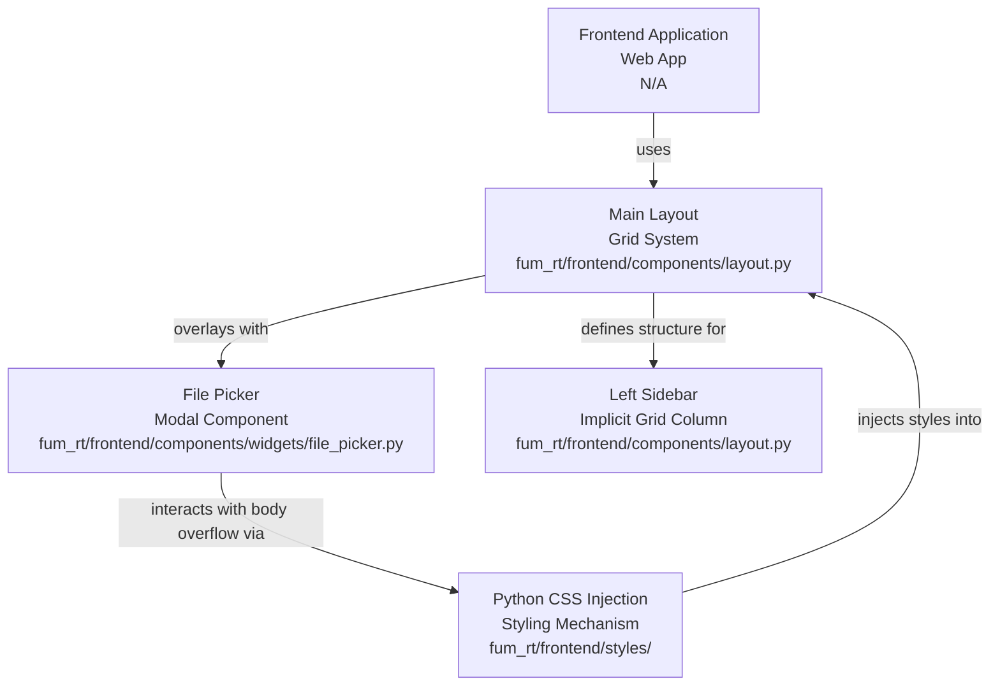
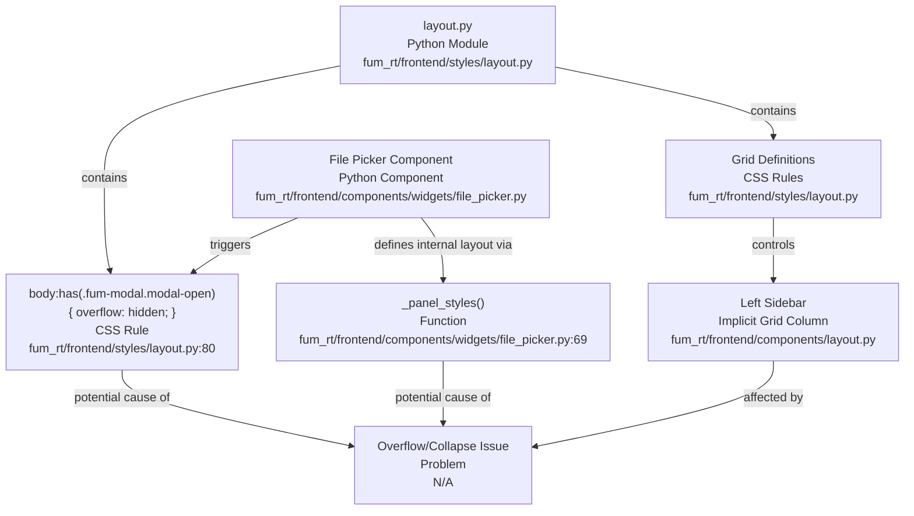

# Codebase Research Report

## Query
Can you find where in the code the layout css is tied both to the file picker while its open and the left sidebar CSS? When I select certain folders in the file picker the background layout CSS overflows and collapses out of it's structure, causing it to overlap on surrounding cards and CSS

## Answer
# Codebase Analysis Report: Layout CSS, File Picker, and Left Sidebar

This report details the connections between the application's layout CSS, the file picker component, and the left sidebar, addressing the user's query regarding layout overflow issues.

## High-Level Architecture




The application's frontend is structured around a main layout that utilizes a grid system for content arrangement. Styling is primarily managed through Python files that return CSS strings, which are then injected into the application. The core layout defines a two-column structure, with one column implicitly serving as a left sidebar. A file picker component, when active, overlays the main application with a modal, which interacts with the body's overflow properties.

## Mid-Level Component Interaction

```mermaid
graph TB
  mainLayoutComp["Main Application Layout<br>Python Component<br>fum_rt/frontend/components/layout.py"]
  leftSidebarComp["Left Sidebar<br>Implicit Grid Column<br>fum_rt/frontend/components/layout.py"]
  filePickerComp["File Picker Component<br>Python Component<br>fum_rt/frontend/components/widgets/file_picker.py"]
  layoutCSS["Layout CSS<br>Python Module<br>fum_rt/frontend/styles/layout.py"]
  workspaceCard["Workspace Card<br>Component<br>N/A"]
  runtimeControlsCard["Runtime Controls Card<br>Component<br>N/A"]
  filePickerModal["File Picker Modal<br>UI Element<br>fum_rt/frontend/components/widgets/file_picker.py"]

  mainLayoutComp --> |"arranges"| workspaceCard
  mainLayoutComp --> |"arranges"| runtimeControlsCard
  mainLayoutComp --> |"applies global CSS via"| layoutCSS
  mainLayoutComp --> |"defines first column as"| leftSidebarComp
  leftSidebarComp --> |"contains"| workspaceCard
  leftSidebarComp --> |"contains"| runtimeControlsCard
  leftSidebarComp --> |"styled by"| layoutCSS
  filePickerComp --> |"contains"| filePickerModal
  filePickerModal --> |"has class"| "fum-modal"
  filePickerModal --> |"styled by"| layoutCSS
  filePickerComp --> |"defines modal styles in"| "_modal_styles()"
  filePickerComp --> |"defines panel styles in"| "_panel_styles()"
```


### Main Application Layout

The overall structure of the application's dashboard is defined within [fum_rt/frontend/components/layout.py](fum_rt/frontend/components/layout.py).

*   **Purpose:** To construct the full dashboard layout by arranging various modular "card" components.
*   **Internal Parts:** It imports and arranges components such as `workspace_card`, `runtime_controls_card`, `perf_card`, `feed_card`, `run_config_card`, `charts_card`, and `chat_card`.
*   **External Relationships:** It applies the global layout CSS by assigning `id="app-grid"` and `className="grid"` to its main container [fum_rt/frontend/components/layout.py](fum_rt/frontend/components/layout.py:50).

### Left Sidebar CSS

The left sidebar is not a distinct component but is implicitly defined by the grid structure within the main application layout.

*   **Purpose:** To house primary navigation and control elements.
*   **Internal Parts:** It comprises the first `html.Div` within the `#app-grid` in [fum_rt/frontend/components/layout.py](fum_rt/frontend/components/layout.py:52-57), containing components like `workspace_card` and `runtime_controls_card`.
*   **External Relationships:** Its styling is governed by the `.grid` and `#app-grid` CSS rules defined in the main layout CSS. Specifically, the `grid-template-columns: minmax(300px, 360px) 1fr;` rule in [fum_rt/frontend/styles/layout.py](fum_rt/frontend/styles/layout.py:22) allocates the first column for this sidebar.

### File Picker Component

The file picker is implemented as a reusable component with a modal overlay.

*   **Purpose:** To allow users to select files from a structured directory tree.
*   **Internal Parts:** The component is defined in [fum_rt/frontend/components/widgets/file_picker.py](fum_rt/frontend/components/widgets/file_picker.py). It consists of a compact display and a modal overlay. The modal's styling is defined by the `_modal_styles()` function [fum_rt/frontend/components/widgets/file_picker.py](fum_rt/frontend/components/widgets/file_picker.py:50) and the panel within the modal by `_panel_styles()` [fum_rt/frontend/components/widgets/file_picker.py](fum_rt/frontend/components/widgets/file_picker.py:69).
*   **External Relationships:** The file picker's modal is given the `className="fum-modal"` [fum_rt/frontend/components/widgets/file_picker.py](fum_rt/frontend/components/widgets/file_picker.py:209). This class is directly targeted by the main layout CSS to control body overflow when the modal is active.

## Low-Level Implementation Details

```mermaid
graph TB
  layoutCSSFile["layout.py<br>Python Module<br>fum_rt/frontend/styles/layout.py"]
  getLayoutCSSFunc["get_layout_css()<br>Function<br>fum_rt/frontend/styles/layout.py"]
  gridSystem["Grid System<br>CSS Rules<br>fum_rt/frontend/styles/layout.py:22-38"]
  cardStyling["Card Styling<br>CSS Rules<br>fum_rt/frontend/styles/layout.py:47"]
  modalStateGuard["Modal State Guard<br>CSS Rule<br>fum_rt/frontend/styles/layout.py:80-83"]
  filePickerModal["File Picker Modal<br>UI Element<br>fum_rt/frontend/components/widgets/file_picker.py"]
  fumModalClass["fum-modal<br>CSS Class<br>fum_rt/frontend/components/widgets/file_picker.py:209"]
  modalOpenClass["modal-open<br>CSS Class<br>N/A"]
  bodyElement["body<br>HTML Element<br>N/A"]
  componentsCSSFile["components.py<br>Python Module<br>fum_rt/frontend/styles/components.py"]
  dashDropdownRule[".dash-dropdown Rule<br>CSS Rule<br>fum_rt/frontend/styles/components.py:34-36"]

  layoutCSSFile --> |"generates CSS via"| getLayoutCSSFunc
  getLayoutCSSFunc --> |"defines"| gridSystem
  getLayoutCSSFunc --> |"defines"| cardStyling
  getLayoutCSSFunc --> |"defines"| modalStateGuard
  filePickerModal --> |"applies"| fumModalClass
  filePickerModal --> |"receives"| modalOpenClass
  fumModalClass --> |"used by"| modalStateGuard
  modalOpenClass --> |"used by"| modalStateGuard
  modalStateGuard --> |"sets overflow: hidden on"| bodyElement
  filePickerModal --> |"defines styles in"| "_modal_styles()"
  componentsCSSFile --> |"provides"| dashDropdownRule
```


### Layout CSS (`layout.py`)

The core layout CSS is generated by the `get_layout_css()` function in [fum_rt/frontend/styles/layout.py](fum_rt/frontend/styles/layout.py).

*   **Purpose:** To provide responsive grid layouts, card styling, and global utility styles.
*   **Key Sections:**
    *   **Grid System:** The `.grid` and `#app-grid` selectors define the main two-column layout, which implicitly creates the left sidebar [fum_rt/frontend/styles/layout.py](fum_rt/frontend/styles/layout.py:22-38).
    *   **Card Styling:** The `.card` selector defines styles for card containers, including `overflow: visible` to prevent dropdown clipping [fum_rt/frontend/styles/layout.py](fum_rt/frontend/styles/layout.py:47).
    *   **Modal State Guards:** Crucially, this file contains the CSS rule `body:has(.fum-modal.modal-open){ overflow: hidden; }` [fum_rt/frontend/styles/layout.py](fum_rt/frontend/styles/layout.py:80-83). This rule is designed to prevent background scrolling when the file picker modal is open.

### File Picker CSS Interaction

The file picker's modal directly interacts with the main layout CSS.

*   **Modal Overlay:** The `_modal_styles()` function in [fum_rt/frontend/components/widgets/file_picker.py](fum_rt/frontend/components/widgets/file_picker.py:50) defines the fixed, full-viewport overlay for the file picker. It sets `overflow: auto` and `overscrollBehavior: contain` for the modal itself.
*   **`fum-modal` Class:** The file picker's modal `html.Div` is assigned the `fum-modal` class [fum_rt/frontend/components/widgets/file_picker.py](fum_rt/frontend/components/widgets/file_picker.py:209).
*   **Overflow Control:** When the file picker modal is open (and thus has the `modal-open` class, which is likely added via callbacks not directly in this file), the `body:has(.fum-modal.modal-open)` rule in [fum_rt/frontend/styles/layout.py](fum_rt/frontend/styles/layout.py:80) sets `overflow: hidden` on the `body` element. This is intended to prevent the main page from scrolling while the modal is active.

### Component-Specific Styles (`components.py`)

The [fum_rt/frontend/styles/components.py](fum_rt/frontend/styles/components.py) file provides component-specific styling.

*   **Purpose:** To style common Dash components like dropdowns and sliders.
*   **Relevance to Issue:** While not directly related to the file picker or sidebar's primary layout, it includes a rule `overflow: visible !important;` for `.dash-dropdown`, `.Select`, and `.Select-menu-outer` [fum_rt/frontend/styles/components.py](fum_rt/frontend/styles/components.py:34-36). This prevents clipping of dropdown menus within containers, which could indirectly affect the visual presentation if the file picker or sidebar contains such elements.

## Conclusion




The layout CSS, particularly the `body:has(.fum-modal.modal-open){ overflow: hidden; }` rule in [fum_rt/frontend/styles/layout.py](fum_rt/frontend/styles/layout.py:80), is directly tied to the file picker's open state. The left sidebar's layout is controlled by the grid definitions in the same layout CSS, applied through [fum_rt/frontend/components/layout.py](fum_rt/frontend/components/layout.py). The reported overflow and collapse issue likely stems from an interaction or conflict with this `overflow: hidden` rule on the `body` when the file picker is active, or how the file picker's internal layout (`_panel_styles` in [fum_rt/frontend/components/widgets/file_picker.py](fum_rt/frontend/components/widgets/file_picker.py:69)) is contained within the modal and how that containment interacts with the main grid layout.

---
*Generated by [CodeViz.ai](https://codeviz.ai) on 8/26/2025, 6:10:23 PM*
