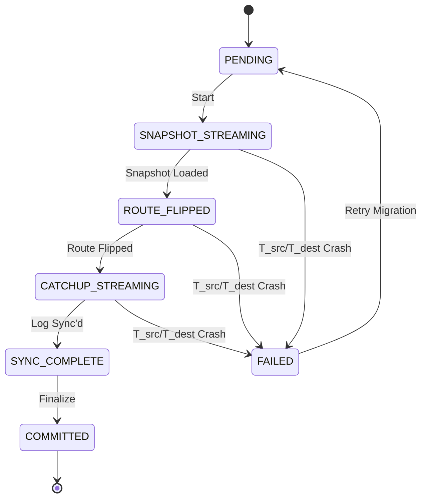

# Technical Summary Report

**Generated on:** October 5, 2025 at 11:19 PM CDT

---

## Generated Summary

### Identified Components

*   **Territory Host:** A self-contained process or container managing a shard of the connectome. Each runs a Territory instance.
*   **Territory Manager (Control Plane):** A leader-elected service responsible for orchestrating Territory lifecycles (bootstrapping, assignment, migration, recovery, garbage collection of snapshots).
*   **Policy Service (Control Plane):** Disseminates versioned `Policy Epochs` (global configurations) to Territories.
*   **Topological Observer (Control Plane):** Passively ingests telemetry from Territories to build a probabilistic, low-fidelity model of the global graph, informing optimization decisions like fragmentation repair.
*   **Routing Coordination Service (RCS):** A consensus-backed system (e.g., etcd) maintaining the definitive, globally consistent `subgraph_ID -> primary_territory_ID` mapping, and managing snapshot metadata.
*   **Replicated Log Service (RLS):** A dedicated, highly-available, low-latency log store (e.g., Apache BookKeeper). It is the *single source of truth* for the ordered history of all state-mutating events.
*   **Durable Snapshot Store (DSS):** A location-independent, highly-durable object store (e.g., S3, GCS) for periodic state snapshots of Territories, crucial for low RTO recovery.
*   **Supernode Primary Territory:** A Territory hosting the core state (soma) of highly connected "supernodes."
*   **Proxy Territories (Supernode Proxies):** Adjacent Territories hosting a lightweight proxy/cache of a supernode's axon terminals, consuming updates from a dedicated log stream.
*   **Log Egress Service:** An asynchronous service (or RLS feature like a CDC connector) that reads committed events from the RLS and publishes them to secondary streams (e.g., Kafka) for proxy consumption.
*   **Saga Log:** A local, persistent log maintained by each Territory for managing the state of multi-step, asynchronous inter-Territory transactions (Sagas).

### Observed Interactions & Data Flow

1.  **Snapshot Persistence Protocol:**
    *   **Initiation:** Territory Host (TH) writes `UPLOADING` snapshot record to RCS.
    *   **Upload:** TH uploads snapshot data to DSS using a `snapshot_uuid`.
    *   **Verification:** TH updates RCS record to `VERIFYING`, adding DSS location/checksum.
    *   **Commit:** TH *atomically* transitions the RCS record to `COMMITTED`, and the *previous* `COMMITTED` snapshot to `SUPERSEDED`.
    *   **Reconciliation Controller:** Periodically scans RCS for stale `UPLOADING`/`VERIFYING` snapshots and garbage collects `SUPERSEDED` snapshots from DSS after a grace period.

2.  **Deterministic & Idempotent Crash Recovery:**
    *   **Discovery:** A restarting TH queries RCS for the latest `COMMITTED` snapshot metadata.
    *   **Load Snapshot:** TH downloads and loads the snapshot data from DSS, noting `last_snapshot_lsn`. If no snapshot, `last_snapshot_lsn` is 0.
    *   **Log Replay:** TH connects to RLS and replays events from `last_snapshot_lsn + 1` to restore its state to the exact pre-crash moment. Event handlers use `event_uuid` for idempotency.
    *   **Operational:** TH becomes `OPERATIONAL`, starts heartbeat.
    *   **Recovery Event:** Territory Manager commits a `TerritoryRecovered` event to the RLS, which includes `recovery_timestamp`.
    *   **Decay Calculation:** The TH's event handler for `TerritoryRecovered` calculates `downtime_duration` using `recovery_timestamp - self.last_heartbeat_ts` and applies uniform decay to its state. This state change is *logged* via the event.
    *   **Background Snapshotting:** TH triggers an asynchronous snapshot to DSS, registering its metadata with RCS.

3.  **Supernode Write Protocol (Single Commit & Asynchronous Egress):**
    *   **Primary Receive:** Primary Territory receives a write event for a supernode.
    *   **RLS Commit:** Event is synchronously produced and committed to the RLS (waits for quorum ACK).
    *   **Client ACK:** Acknowledgment is sent to the client *after* RLS commit.
    *   **Asynchronous Egress:** A separate Log Egress service reads the committed log from RLS and publishes it to a shared durable log stream (e.g., Kafka) for Proxy Territories.
    *   **Proxy Consumption:** Proxy Territories consume from this stream to update their local caches, with monitoring for replica lag.

4.  **Phased Territory Migration Protocol (Hardened & Unambiguous):**
    *   **Manager Orchestration:** Territory Manager (TM) assigns `migration_epoch` and manages migration state machine in RCS.
    *   **Low-Pause Snapshot:** `T_src` initiates a copy-on-write snapshot, recording `snapshot_LSN`, and buffers new writes.
    *   **Stream Snapshot:** `T_src` streams snapshot to `T_dest`.
    *   **Atomic Route Flip:** TM performs atomic CAS on RCS, flipping subgraph `S`'s primary to `T_dest`.
    *   **Stream Catch-up Log:** `T_src` streams buffered events, then live log from RLS (from `snapshot_LSN + 1`) to `T_dest`. `T_dest` sends `acknowledgements` for processed LSNs. `T_src` persists `last_acknowledged_lsn_by_dest` to RCS/RLS.
    *   **Synchronize & Go Live:** `T_dest` processes catch-up log, becomes `OPERATIONAL`.
    *   **Commit:** TM marks migration `COMMITTED`.
    *   **Mid-Handoff Crash Recovery (Host-Loss Resilient):**
        *   If `T_src` host is lost after route flip: TM detects failure.
        *   TM retrieves `last_acknowledged_lsn_by_dest` (authoritative LSN from RCS/RLS).
        *   TM authorizes `T_dest` to connect *directly to RLS* and replay subgraph `S`'s log from `last_acknowledged_lsn_by_dest + 1`.
        *   `T_dest` syncs, then proceeds to `SYNC_COMPLETE`.

5.  **Re-Platforming Write Shadowing (High-Fidelity):**
    *   **Write Mirroring:** All write requests to `T_src` are asynchronously copied to `T_dest`.
    *   **Isolated Transaction:** `T_dest` initiates a transaction in an isolated context (e.g., commit-then-rollback, forkable memory).
    *   **Full Write Path:** `T_dest` executes the *entire write path*, including final commit logic (lock acquisition, validation), capturing latency/throughput.
    *   **Rollback/Discard:** The transaction is rolled back or context discarded. `T_dest`'s primary state remains updated by the main replication stream.
    *   **Performance Validation:** Metrics from these full, isolated writes are compared against SLOs for cutover approval.

### Inferred Design Rationale

*   **Host-Loss Resilience & Low RTO:** The shift from local WALs to the Replicated Log Service (RLS) and Durable Snapshot Store (DSS) ensures data durability and fast recovery even if an entire host is permanently lost. Snapshots reduce the log replay burden, while the RLS provides the authoritative, host-independent event history.
*   **Atomicity & Consistency:** Critical operations spanning multiple distributed components (e.g., snapshot registration, migration route flips) are designed with explicit state machines and atomic Compare-And-Swap (CAS) operations on the RCS to prevent inconsistent states, orphan data, and race conditions.
*   **Deterministic & Idempotent Recovery:** State changes from downtime decay are now explicitly logged as `TerritoryRecovered` events, making the recovery process fully deterministic and idempotent. The state is always a pure function of the event log, preventing subtle data corruption from repeated recoveries.
*   **Elimination of Single Points of Failure & Bottlenecks:**
    *   The RLS replaces local disk WAL, removing a critical SPOF.
    *   The Supernode write path uses a single synchronous commit to RLS, with asynchronous egress to Kafka, eliminating the availability bottleneck of previous dual-write designs.
    *   The RCS is designed for high availability and cacheability to prevent it from becoming a routing bottleneck.
*   **Efficient Migration & Exactly-Once Semantics:** The Phased Territory Migration Protocol leverages LSNs and acknowledged streaming to guarantee exactly-once processing of events during handoff, even with failures. The streamlined crash recovery for migration bypasses unnecessary re-hydration of `T_src`, dramatically improving RTO for active migrations.
*   **Accurate Performance Validation:** The re-platforming protocol includes comprehensive shadowing of *both* read and *simulated, full-path writes* to accurately assess the target storage backend's performance under realistic load (including contention simulation) before cutover, de-risking the operational transition.
*   **Self-Contained & Fault-Tolerant Protocols:** Protocols like the Synaptic Handshake (Saga-based) include explicit reconciliation, timeouts, and compensating actions to maintain Territory isolation and resilience against partial failures without blocking operations.
*   **Operational Control & Observability:** Mechanisms for control plane lifecycle management, client-side caching with backoff/jitter, and comprehensive system observability (tracing, metrics, structured logs) are mandated to ensure stability and debuggability in a large-scale distributed environment.

### Operational Snippets

#### Pseudocode: Deterministic & Idempotent Crash Recovery
```
function on_territory_restart(replicated_log_service, snapshot_store, rcs_client, territory_manager_client):
  // 1. Discover the latest COMMITTED snapshot.
  snapshot_metadata = rcs_client.get_latest_committed_snapshot(self.id) // Can be null

  last_snapshot_lsn = 0
  if snapshot_metadata is not null:
    // 2. Load state from the durable, location-independent object store.
    snapshot = snapshot_store.download_snapshot(snapshot_metadata.location)
    load_state_from_snapshot(snapshot.data)
    last_snapshot_lsn = snapshot_metadata.lsn

  // 3. Replay the authoritative event log from where the snapshot left off.
  replicated_log_service.replay_from(last_snapshot_lsn + 1, self.id, store)

  // 4. BECOME OPERATIONAL. RTO is achieved at this point.
  current_lsn = replicated_log_service.get_last_lsn(self.id)
  start_heartbeat_process(self.id, current_lsn)
  enable_actuator()

  // 5. Territory Manager commits a deterministic recovery event to the log.
  recovery_timestamp = liveness_service.get_current_timestamp()
  territory_manager_client.commit_event(
    self.id,
    {type: "TerritoryRecovered", timestamp: recovery_timestamp}
  )

  // 6. Trigger non-blocking background snapshotting.
  trigger_background_snapshot(store, current_lsn, snapshot_store, rcs_client)
```

#### Migration State Machine Diagram


#### RCS Key-Value Schema Example
```json
// Key: routes/subgraphs/{subgraph_ID}
{
  "primary_territory_id": "territory-042",
  "version": 7,
  "last_updated_ts": "2023-10-27T10:00:00Z"
}
```

#### `mandate.fulfillment.failed` Event Schema Example
```json
{
  "event_id": "uuid-...",
  "event_type": "mandate.fulfillment.failed",
  "source_territory": "territory-008",
  "mandate_id": "grow-frag-123",
  "reason_code": "PEER_REJECTION",
  "details": "Peer territory-009 rejected synapse; reason: max_degree_policy_exceeded"
}
```

## Key Highlights

* The Replicated Log Service (RLS) serves as the single source of truth for the ordered history of all state-mutating events, ensuring data durability and consistency across the system.
* The Durable Snapshot Store (DSS) provides location-independent, highly-durable storage for periodic state snapshots, which is crucial for achieving a low Recovery Time Objective (RTO) and host-loss resilience.
* Crash recovery is deterministic and idempotent; territories restore their state from DSS snapshots and replay events from the RLS, with downtime decay explicitly logged to maintain consistency.
* The Territory Manager orchestrates territory lifecycles and the Routing Coordination Service (RCS) maintains the definitive, globally consistent mapping of subgraphs to their primary territories.
* The Phased Territory Migration Protocol ensures exactly-once event processing during handoff, incorporating host-loss resilient crash recovery to guarantee continuity during active migrations.
* Supernode writes are optimized by a single synchronous commit to the RLS for client acknowledgment, with asynchronous egress to proxy territories, balancing strong consistency with performance.
* The re-platforming process includes high-fidelity write shadowing, where new backends execute full write paths in an isolated context to accurately validate performance against SLOs before cutover.
* Critical single points of failure and bottlenecks are eliminated by replacing local WALs with the highly-available RLS and utilizing asynchronous mechanisms for supernode updates and proxy consumption.

## Next Steps & Suggestions

* Conduct comprehensive stress testing and failure injection for the Replicated Log Service (RLS) and Durable Snapshot Store (DSS) to validate their scalability, durability, and recovery characteristics under extreme load and failure scenarios.
* Develop and implement detailed end-to-end observability (tracing, metrics, logging) for all key distributed protocols, especially Territory Migration and Crash Recovery, ensuring actionable dashboards and alerts are in place for operational teams.
* Investigate and validate the real-world end-to-end latency and consistency guarantees of the Supernode Write Protocol, specifically monitoring Log Egress service performance and Proxy Territory replica lag to identify potential bottlenecks or data staleness.
* Perform a deep dive into the fault tolerance, scalability, and recovery mechanisms of the Control Plane services (Territory Manager, Policy Service, Topological Observer, Routing Coordination Service) to ensure their resilience matches the requirements of the data plane.

---

*Powered by AI Content Suite & Gemini*
