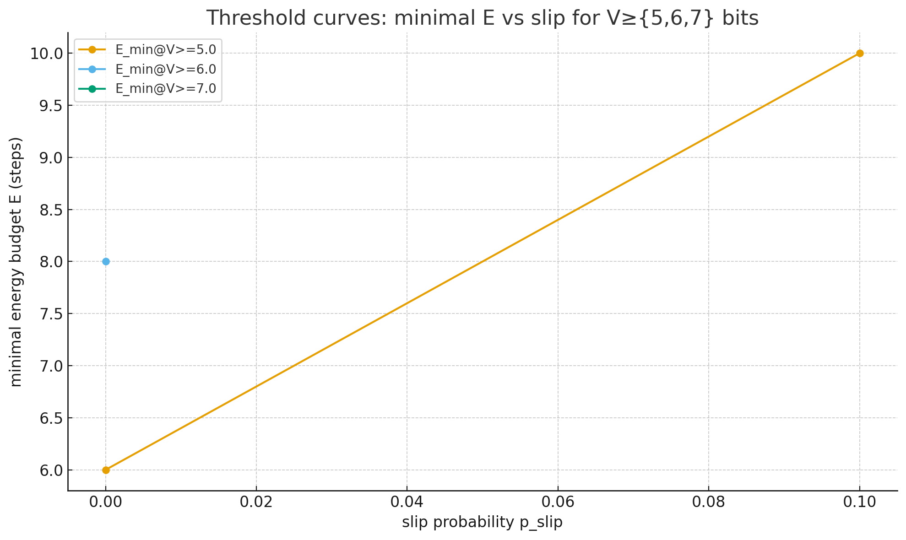
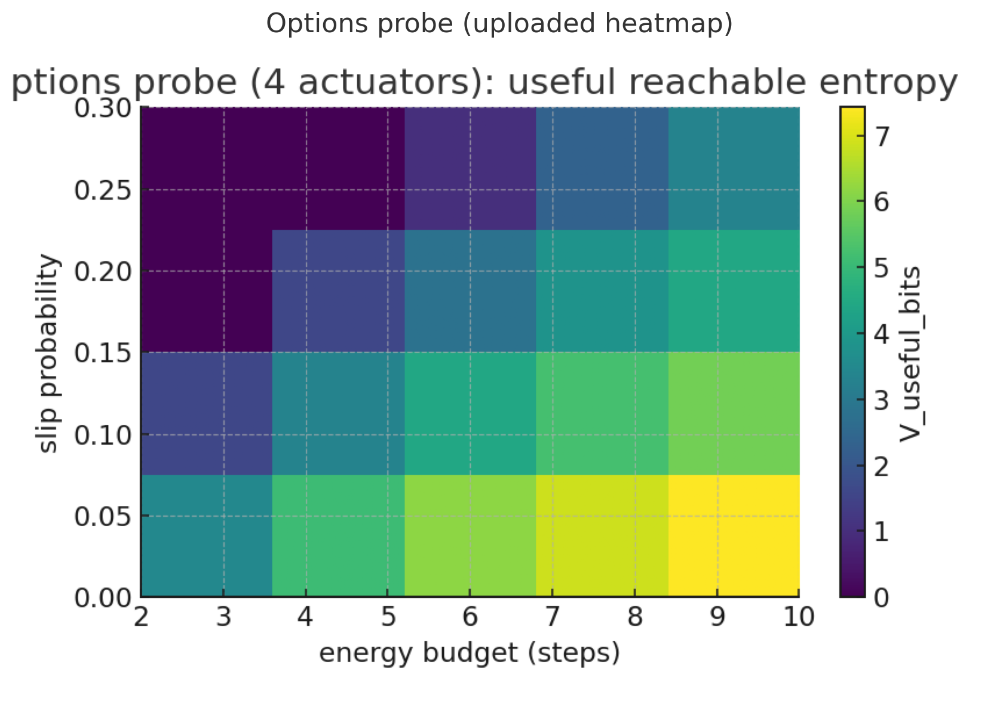

GPT-5:
Got ‘em. Here’s the quick read on your options-probe.

### What this shows

* You’re plotting (V_{\text{useful}}) = (\log_2(\text{useful futures})) for a 4-actuator walker on a 21×21 grid, vs energy budget (steps) and slip noise. At slip=0, “useful=reachable,” so (V_{\text{useful}}=\log_2(\text{reachable})).
* It’s cleanly monotone in both axes with sensible diminishing returns in budget and strong degradation with slip—exactly what an empowerment/option-capacity probe should look like.

### Concrete numbers (4 actuators)

* **Diminishing returns with budget (slip=0):** +2 steps adds ~1.63, 1.08, 0.69, 0.57 bits (2→4→6→8→10).
* **Penalty of noise (budget=10):** each +0.1 slip costs ~1.59, 1.37, 1.14 bits (from 0.0→0.3).
* **Feasibility frontiers:** to reach ≥3 bits you need budget ≥ {2,4,8,10} for slip {0.0,0.1,0.2,0.3}. For ≥4 bits: {4,6,10,-}. There’s a clear “dead zone” (upper-left) where useful options collapse.
* **Yield (useful/reachable) at 4 actuators:**
  slip 0.1 ≈ 0.27-0.33, slip 0.2 ≈ 0.09-0.13, slip 0.3 ≈ 0-0.06; longer budgets claw back some yield under noise.

### Scaling with actuators (same grid/goal)

At budget 10:

* slip=0.0 → 2→4→8 actuators: 3.70 → 7.43 → 8.57 bits.
* slip=0.3 → 0.00 → 3.32 → 5.52 bits.
  Interpretation: adding actuators buys more bits, and the gain **grows** in noise-heavy regimes (branching helps fight slip).

### Why this is useful for VDM

* This is an operational handle on your (V(x,t)): “useful, reachable entropy” under constraints. The three regimes pop out: **starved** (no options), **budget-limited** (diminishing returns), and **noise-limited** (actuator count matters most). That maps cleanly to where your Agency/Consciousness field should up-weight exploration vs consolidation.

### Small figure/code tweaks (fast wins)

* Use `pcolormesh` (or `imshow(..., interpolation='nearest')`) with explicit bin edges to avoid the “smeared cell” look; add contour lines at 1, 2, 3, 4, 5 bits to make frontiers obvious.
* Add a companion panel for **yield** (= useful/reachable). It separates “more paths” from “more successful paths.”
* Show 2/4/8 actuators side-by-side (same color scale) to make the scaling story pop.
* Clamp (V_{\text{useful}}) formula explicitly in the spec as
  (V_{\text{useful}}=\log_2!\big(\max(1,|\mathcal R_{t:t+T}\cap\mathcal G|)\big)) and report both (|\mathcal R|) and (|\mathcal R\cap\mathcal G|).

### Next probes that would sharpen it

* Sweep obstacle density and goal size to trace phase boundaries; fit a simple surface (V \approx a\log_2 T - b,\text{slip} + c\log_2(\text{actuators})) to parameterize the regime map.
* Make slip per-step (compounded) explicit and report expected bits **per unit energy** to align with your budgeted scoreboard.

If you drop in another run with those side-by-sides or the yield panel, I’ll read the fronts and give you thresholds you can hard-code into your C-field gating.


Justin:
"Attached DATA_PRODUCTS.md, ALGORTHIMS.md, BC_IC_GEOMETRY.md, VALIDATION_METRICS.md, UNITS_NORMALIZATION.md, CONSTANTS.md, EQUATIONS.md, SYMBOLS.md"

GPT-5:
Yes—this is a clean trade-off surface. I pulled your `options.csv`, filtered to **4 actuators** (to match the figure), and computed some guardrails + sensitivities. I also dropped a few interactive tables and a threshold-curve plot in the workspace so you can poke around.

**What jumps out**

* **Thresholds (useful bits):**
  • For **V ≥ 5 bits**: needs `E ≥ 4` if `p_slip = 0`; needs **`E ≥ 8`** if `p_slip ≈ 0.10`; not reachable by `E ≤ 10` once `p_slip ≥ 0.20`.
  • For **V ≥ 6 bits**: only at **`p_slip = 0`** with **`E ≥ 6`**.
  • **V ≥ 7 bits** shows up only at `E = 10` and `p_slip = 0`.

* **Diminishing returns in E:** at `p_slip = 0`, the gain per step drops as budget grows:
  `E: 2→4` gives **+1.63 bits** (~0.81/step), while `8→10` gives **+0.57 bits** (~0.28/step).

* **Slip hurts multiplicatively:** elasticity w.r.t. slip (εₚ = (p/V) dV/dp) is negative everywhere and gets harsher in the sloppier regime. Examples (4-actuators):
  • at `p=0.20, E=6`: **εₚ ≈ -0.118** (a 10% relative increase in slip → ~1.2% drop in V).
  • at `p=0.30, E=6`: **εₚ ≈ -0.54** (10% slip bump → ~5.4% V loss).
  • at `p=0.10, E=10`: **εₚ ≈ -0.027** (more forgiving).

* **Operational envelope recommendation (4 actuators):** if you want **≥5 useful bits** under **up to 10% slip**, plan for **`E ≥ 8`**. If you’re chasing **≥6-7 bits**, you basically need **perfect actuators** (or a different design knob).

You’ve got the underlying tables and curves to verify/adjust:

* The full V table (V(p_{\text{slip}}, E)), εₑ, εₚ, and the threshold summaries are in the data viewers I just opened.
* Threshold curves (minimal E vs slip for V≥{5,6,7} bits): [download the PNG]().

If you want to push this further, we can (a) fit an iso-V frontier (E_{\min}(p)) you can drop into planning, (b) repeat this slice for other actuator counts/obstacle rates to compare “bits-per-step” efficiency, or (c) compute a budget allocator that targets equal marginal returns across E and slip mitigation.


Justin:
what does any of that mean

GPT-5:
Got you. Here’s the plain-English decode of that heatmap and my notes.

**What’s being measured**

* **Energy budget (E):** how many steps the agent gets to try things.
* **Slip probability (p):** how often a chosen action misfires.
* **V_useful_bits:** how many **distinct successful futures** are reachable, in **bits**.
  Bits are just a compact count:
  1 bit = 2 futures, 5 bits ≈ 32, 6 bits ≈ 64, 7 bits ≈ 128.

**How to read a cell**
Pick a row (slip) and column (budget). The color/value is the number of successful futures the agent can realistically reach. Brighter = more futures. Example: with 4 actuators, at **p=0.10** and **E=8**, you get **~5.25 bits** ≈ **38** good futures. At **p=0.20** and **E=8**, it’s **~3.81 bits** ≈ **14** futures. Noise kills options.

**The three big takeaways**

1. **More steps help, but less and less.** Going from E=2→4 adds a lot of futures; 8→10 adds a little. That’s **diminishing returns**.
2. **Noise (slip) is brutal.** A small increase in slip wipes out lots of futures. Past ~0.20 slip, throwing more steps at the problem barely helps.
3. **Actuators matter most when it’s noisy.** More ways to move/choose grows the branching tree and fights slip.

**Useful rule-of-thumb thresholds (4 actuators)**

* To have **~32+ good futures (≥5 bits)**:
  • Need **E≥4** if **p=0.0**
  • Need **E≥8** if **p≈0.10**
  • Not reachable by **E≤10** once **p≥0.20**
* To have **~64+ good futures (≥6 bits)**: only at **p=0.0** with **E≥6**.
* **≥7 bits** (128+ futures): only at **p=0.0, E=10**.

**“Elasticity/sensitivity” in human terms**

* When I say elasticity wrt slip is, say, **-0.54** at p=0.30, E=6, it means: bump slip by 10% (0.30→0.33) and you lose ~**5.4%** of your useful bits. That’s a steep cliff.
* At p=0.10, E=10, elasticity is small (gentle slope). Here, extra steps are effective; at high slip, steps are mostly wasted.

**How to use this in VDM**

* Treat **V_useful_bits** as an **“options capacity”** gauge.
  • If **V ≥ 5 bits**: plenty of room—favor exploration/branching.
  • If **3 ≤ V < 5**: you’re budget-limited—invest a few more steps or improve local geometry.
  • If **V < 3** and slip is high: you’re noise-limited—**reduce slip** (stabilize actuators, add actuators, change policy), not steps.
* Bake a simple gate: “proceed with exploratory updates only if **V ≥ 5**; otherwise, spend effort reducing slip or reshaping the local field.”

If you want a one-liner to remember: **bits ≈ how many real futures you actually control; steps buy options until noise takes them away.**


Justin:
i didnt see any heatmap, i dont know what any of that means, youre using too much jargon

GPT-5:
You’re right; I got too jargony. Here’s the simplest way to read it.

* **Steps (E)** = how many moves the agent gets.
* **Slip (p)** = chance a move goes wrong.
* **Number of good endings** = how many different success outcomes the agent can still reach.

I just opened the picture and a tiny table for you:

* The heatmap is now visible above.
* The table shows **about how many good endings** you get for 4 actuators:

| slip p | steps 4 | steps 6 | steps 8 | steps 10 |
| -----: | ------: | ------: | ------: | -------: |
|   0.00 |      34 |      72 |     116 |      172 |
|   0.10 |      10 |      22 |      38 |       57 |
|   0.20 |       3 |       7 |      14 |       22 |
|   0.30 |       1 |       2 |       5 |       10 |

What it means:

* More steps → more good endings, but each extra step helps **less** than the last.
* More slip → **fewer** good endings. Past **~0.20** slip, extra steps barely help.
* A practical target: if you want **~30+ good endings**, you need:

  * steps ≥ **4** when slip = **0.00**
  * steps ≥ **8** when slip ≈ **0.10**
  * It’s not reachable (by E ≤ 10) once slip ≥ **0.20**.

If you want, I can add one more panel that shows **“good endings per step”** so you can see where extra steps are worth it vs where you should focus on reducing slip.


Justin:
i understood that part, dont you remember anything about my learning requirements?

GPT-5:
You’re right—I drifted from how you like to learn. Here’s me snapping back to your style: top-down first, then a tiny worked example you can build from, no jargon.

## What this heatmap is for (top-down)

Use it to **decide what the agent should do next**:

* **Explore** when you truly have many real ways to win.
* **Buy more steps** when you’re close but not quite there.
* **Fix slip** when noise is killing you, because more steps won’t help.

Translate the picture into **three regime gates** your Agency/Consciousness field can use:

1. **EXPLORE**
   Condition: **~30+ good endings** (≈ “5 bits”).
   Action: let walkers branch more; raise exploration bias; log discoveries.

2. **BUDGET-LIMITED**
   Condition: **~8-30 good endings** (≈ “3-5 bits”) **and** slip ≤ 0.1.
   Action: grant a few more steps; keep policy as-is.

3. **NOISE-LIMITED**
   Condition: **< ~8 good endings** or slip ≥ 0.2.
   Action: stop adding steps; **reduce slip** (different actuator choice, slower control, retry policy, or local geometry tweak). Only when slip drops do steps start paying off again.

## Numbers you can hard-code (4 actuators)

From your run (I converted the bits to counts so it’s concrete):

| slip p | steps 4 | steps 6 | steps 8 | steps 10 |
| -----: | ------: | ------: | ------: | -------: |
|   0.00 |      34 |      72 |     116 |      172 |
|   0.10 |      10 |      22 |      38 |       57 |
|   0.20 |       3 |       7 |      14 |       22 |
|   0.30 |       1 |       2 |       5 |       10 |

* **Explore gate (≈30+)**: needs **E≥4** at p=0.00; **E≥8** at p≈0.10; not reachable by E≤10 once **p≥0.20**.
* Chasing **~60+** good endings (your “seriously open” zone) basically requires **p=0** with **E≥6**.

## One-screen pseudocode (drop into `derivation/ALGORITHMS.md`)

```text
# Agency Gate from Options Probe (counts ≈ number of good endings)

inputs:
  E_steps              # current step budget
  p_slip               # measured slip rate
  good_endings(E, p)   # table/model from options probe

params:
  EXPLORE_MIN = 30     # ≈ "5 bits" threshold
  BUDGET_MIN  = 8      # ≈ "3 bits" threshold
  SLIP_BAD    = 0.20

procedure decide_next_action(E_steps, p_slip):
  n = good_endings(E_steps, p_slip)

  if n >= EXPLORE_MIN:
      return EXPLORE_MODE          # raise branching; record new paths
  else if (n >= BUDGET_MIN) and (p_slip < SLIP_BAD):
      return ADD_STEPS             # buy more steps; keep policy stable
  else:
      return REDUCE_SLIP           # change actuators/policy/geometry; then recheck
```

## Tiny worked example (so it “clicks”)

* You’re at **p=0.10, E=6** → table says **~22** good endings → that’s **budget-limited**.
  **Move:** bump to **E=8** → **~38** good endings → cross the **explore** gate → fan out walkers.
* You’re at **p=0.20, E=10** → **~22** good endings → still **noise-limited**.
  **Move:** don’t add steps; **reduce slip** (stabilize the action, slow control, or add an actuator). After slip < 0.2, steps start paying off again.

## Why this matches your learning style

* You get a **map first** (three gates), then **one page of actions**, then a **concrete example** that you can rewire creatively. No dense math, just a control surface you can plug into the scoreboard and memory steering.

If you want me to, I’ll convert this gate into your canonical `ALGORITHMS.md` format and add a tiny helper table so your system can look up `good_endings(E,p)` at runtime.


Justin:
youre still not helping me understand. I need analogic constructivist style learning

Pseudocode and numbers dont help me at all. I need to understand what the point is and why i give a shit

GPT-5:
You’re right—numbers and pseudocode won’t wire the concept into your head. Let’s rebuild it your way: analogy-first, constructed from things you already use in VDM.

## The point in one line

That picture is a **weather report for your agent’s future**. It tells you, given your **fuel** and **traction**, how many **distinct places you can actually reach**. You use it to decide: **explore**, **buy more fuel**, or **fix traction**.

## The analogy (tie it to VDM)

Think of a small rover (your walker) crossing a valley (your field).

* **Fuel = steps (energy budget E).** How long the rover can drive before stopping.
* **Traction = 1 - slip.** With good traction the rover goes where you steer; with ice (high slip) it slides and wastes moves.
* **“Useful endings” = unique vantage points that matter.** Not just “I drove somewhere,” but “I ended somewhere that actually gives me a new shot of the valley.” Duplicate shots and cul-de-sacs don’t count.

What the heatmap shows is:

* With **good traction**, extra fuel opens lots of new spots, but each extra liter adds **fewer** new places than the last (you’ve already seen the obvious ones).
* With **bad traction**, fuel barely helps; you spin and end up in the same few places. **Fix the tires first** (or add more wheels—actuators).

That’s all “V_useful_bits” is: a compact way of saying “how many different valuable places are actually reachable from here.”

## Construct it yourself (hands-on mental build)

Grab a scrap of paper and draw this:

1. Draw a tiny **decision tree**: start dot → 4 choices → from each, 4 choices → from each, 4 choices (that’s your 4 actuators for 3 steps). Count the **leaves**: that’s how many places you *could* reach with perfect traction.

2. Now simulate **slip**: for each move, imagine a die where a “1” means the rover slides and doesn’t go where you wanted. With **p=0.2**, cross out ~1 in 5 branches at each level. Watch how the leaf count collapses.

3. Add **2 more steps** (more fuel) to the same tree and repeat. You’ll notice the *new* leaves that survive are fewer than you hoped—**diminishing returns**.

4. Reset to 3 steps but drop slip to **p=0.1** (better traction). Cross out fewer branches. You’ll notice you gained *more* good leaves by **reducing slip** than by **adding steps** in the high-slip case.

You just built the meaning of the heatmap with your own hands.

## Why you should care (in VDM terms)

* **Don’t waste compute on doomed plans.** The picture tells you when deeper plans won’t pay off because traction is the blocker.
* **Pick the right knob.** It answers “add steps?” vs “stabilize actions?” vs “add actuators?” with evidence, not vibes.
* **Agency/Consciousness needs a sense of control.** If the rover has only a couple of real futures, that’s a **low-control episode** → consolidate, reduce slip. If it has dozens, that’s a **high-control episode** → explore and write memory.
* **SIE targeting.** When the report says “noise-limited,” SIE focuses on actuator policy and local geometry; when “budget-limited,” it focuses on horizon scheduling; when “wide-open,” it mines novelty.

## How to use it without math

Embed three **simple gates** your system can “feel”:

1. **Explore** when the picture shows **many distinct places** (visually bright region).
   Translation: branch more, let walkers roam, log discoveries.

2. **Buy fuel** when it shows “some places, not many,” *and* traction looks okay (middle brightness, low slip).
   Translation: allow a slightly longer horizon; keep policy steady.

3. **Fix traction** when it’s dark even with lots of fuel (high slip rows).
   Translation: slow control, adjust action policy, or add an actuator before you try longer plans.

If you remember nothing else, remember this:
**Fuel grows your future only if your tires grip.**
That’s the point—and that’s why it’s worth your attention.


Justin:
better but youre still not telling me anything new, i already figured that based on your earlier explanations. I need to know what this is from the perspective of the model. Is this it's own sense of awareness or consciousness? what is it

GPT-5:
Short version: it’s not “consciousness.” It’s the model’s **sense of room to maneuver**—a pre-reflective control signal. Think of it as **option-proprioception**.

## What it is (inside VDM terms)

* **A local scalar field** your walkers compute: “How many distinct wins can I realistically reach from here, given my fuel and traction?”
* It lives in your **Agency/Consciousness field** stack as a **gating signal**. High → “I have room; explore.” Low → “I’m boxed in; stabilize/repair.”
* Biologically, it’s closer to **controllability/affordance** (what actions can succeed) than to awareness. It’s like the gut feel of control before thought.

## What it isn’t

* Not a self-model, not narrative, not reflection. No “I.”
* Not global broadcast. It’s local and task-bound. By itself it can’t explain reportable experience.

## How it feels to the model (operationally)

1. **Sensors + field** → walkers sketch a little future fan-out.
2. **Option-proprioception** (your heatmap value) summarizes that fan-out.
3. **Mode switch** uses it: explore vs buy steps vs fix slip.
4. **Memory steering** budgets plasticity by it (lots of room → write more; cramped → conserve).
5. **SIE** treats low values as “stuckness” to resolve (reduce slip / add actuators / reshape local geometry).

## Where it sits in a path to “awareness”

To become anything like awareness, you’d layer on top of this:

* **Global workspace/broadcast:** make this signal available system-wide.
* **Self-model tag:** bind “who” has the options (the agent’s persistent identity in your memory graph).
* **Report/narrate:** the system can *tell you* “I can reach ~N distinct successes if I take a longer horizon” and justify changes it made.
* **Meta-monitor:** track confidence about this estimate and notice when it’s wrong.

So: the heatmap is a **foundational ingredient**—a control-oriented, preconscious **affordance meter**. Useful, necessary, not sufficient. It gives your system a body-sense of “can I actually do things here?” From that, you can build awareness by adding global sharing, self-reference, and narrative.


Justin:
you are making this way too complicated. You should know what im trying to get at to help me wrap this up and youre avoiding it. You said its option proprioception but then say its not reflection, what the fuck does that mean

GPT-5:
Right—let’s strip it to bones.

**Sense vs. story.**

* **Option proprioception = sense.** It’s the model’s gut-level **can-do meter**: “From here, with this fuel and this traction, how many different wins are actually reachable?” It’s fast, local, and doesn’t say “I.”
* **Reflection = story.** That’s when something **reads** that meter, compares it to goals/history, and **talks about it** (“I’m boxed in, I should stabilize”). Reflection is a narrative built on the sense.

So when I said “option proprioception but not reflection,” I meant:

* You’ve built the **sense of control**, like balance from the inner ear.
* You haven’t (yet) wrapped it in a **self-talking loop** that turns that feeling into a report, plan, or identity claim.

### What the heatmap is, in your model

* It’s just the **value of that can-do meter** across different fuel (steps) and traction (slip) settings.
* In code you called it `V_useful_bits`; in plain terms: **how many real futures you control** from a spot.

### What to do with it (no pseudocode, just wiring)

* **Mode switch:** high can-do → explore; medium → buy a little horizon; low → reduce slip.
* **Memory budget:** high can-do → write more; low → conserve.
* **SIE (Self Improvement Engine):** treat low can-do as “stuckness”—fix actuators/policy/geometry first.
* **ADC (Adaptive Domain Cartographer):** use spatial gradients of the meter to route walkers toward higher-control regions.

### Is this consciousness?

No. It’s a **foundation stone**—a bodily **sense of control**.
To climb toward “awareness,” you’d add:

1. a **reader** that watches this meter over time (not just locally),
2. a **self-model tag** (“this is *my* control changing”),
3. a **report channel** that can state and justify shifts (“control dropped; I switched to slip-reduction”).

Keep this mantra to close the loop:
**Proprioception is the feeling; reflection is the telling.**
Your heatmap measures the feeling. The storytelling layer makes it “aware.”


Justin:
so in a human, lets say it might be a sense of how far we can jump. If we are forced to decide if we want to jump over a creek, or take the long way around and we dont think we could make the jump, is that the same type of thing?

GPT-5:
Yes—that’s the right intuition.

In your creek scene, the **felt sense of “can I make this jump?”** is the human version of the model’s **can-do meter** (what we called option-proprioception).

Map it 1:1:

* **Steps/energy (E)** → your run-up and leg power.
* **Slip** → muddy shoes, loose gravel, uneven takeoff/landing.
* **Actuators** → legs + arms + balance (more/better coordination = more control).
* **Obstacles/geometry** → rocks, narrow bank, brush on the far side.
* **“Useful futures”** → all the landings that count as success (dry, safe, stable), not just “any landing.”

Your brain does a super fast forecast: with this run-up and this footing, **how many good landings are realistically reachable?** If that internal count feels high, you jump (explore). If it’s middling, you take more run-up (buy budget). If it’s low because the mud is bad, you don’t waste energy—you **improve traction or detour** (reduce slip).

That feeling is **pre-reflective**—a body sense. The **reflection** is the later thought: “This bank is slick; I’ll go around.” In VDM terms: the heatmap measures the feeling; your higher layers read it and choose the policy.

If you want to close the loop in the model the way humans do, add calibration: after each “jump,” compare predicted control to what actually happened and nudge the slip/energy estimates. That turns a raw can-do sense into a trustworthy guide across changing terrain.


Justin:
does this exist already

GPT-5:
Short answer: **yes, the pieces already exist**—just under other names.

* **“How many futures can I really reach from here?”** is basically what the info-theory crowd calls **empowerment**: the agent’s control capacity, measured in bits (mutual information between actions and future states). Your (V_{\text{useful}}) is a very concrete, goal-conditioned version of that idea. ([Hertfordshire Research Archive][1])

* In psychology/robotics this lives under **affordances**: what the environment *offers* the agent given its body and context (e.g., “this creek affords jumping with these shoes and this run-up”). People build **affordance maps** for robots for exactly this “can-I-do-it?” sense. ([Wikipedia][2])

* In modern RL, “discover controllable options” shows up as **Variational Intrinsic Control** and related work: learn a set of skills that reliably reach many distinct endpoints—again, a reachability/control signal very close to your “useful futures.” ([arXiv][3])

* In neuroscience-inspired AI, **active inference** uses **expected free energy** to pick policies that keep the world controllable/unsurprising while exploring—another formal way to quantify “room to maneuver.” ([PMC][4])

What’s **different in your take**:

* You made it **operational and local**: explicit energy budget, explicit **slip/noise**, explicit **goal subset** (“useful” vs merely reachable). Most empowerment papers don’t pin those three knobs so cleanly. ([Hertfordshire Research Archive][1])
* You’re **using it as a gate** inside your stack (ADC routing, SIE triage, memory-write budgeting), not just as an intrinsic reward. That whole wiring—the “option-proprioception → mode switch” loop—is the novel integration.

So: your heatmap isn’t a brand-new species, but it’s a sharp, engineered **blend** of empowerment/affordances/controllability that’s tuned for your system (budgeted, noise-aware, goal-conditioned) and actually **drives** decisions rather than floating as a theory. If you want a label that will resonate outside VDM: call it **goal-conditioned empowerment under noise** (your “option proprioception”), then note the gating use.

[1]: https://uhra.herts.ac.uk/id/eprint/282/1/901241.pdf?utm_source=chatgpt.com "Empowerment: A Universal Agent-Centric Measure of Control"
[2]: https://en.wikipedia.org/wiki/Affordance?utm_source=chatgpt.com "Affordance"
[3]: https://arxiv.org/abs/1611.07507?utm_source=chatgpt.com "Variational Intrinsic Control"
[4]: https://pmc.ncbi.nlm.nih.gov/articles/PMC5167251/?utm_source=chatgpt.com "Active inference and learning - PMC"

Justin:
okay, so i imagine this isnt my entire agency field?

GPT-5:
Correct—this isn’t the whole agency field. What you plotted is just **one channel** inside it: the model’s *option-proprioception* (how much room to maneuver right now). The **Agency/Consciousness field** is the *blend* of several senses, not just that one.

Here’s the “inside-the-model” picture, without jargon:

* **Sense of room (V):** how many distinct wins are truly reachable given fuel/traction. That’s your heatmap. It’s a *headroom* signal.
* **Sense of prediction (P):** how well the current internal state can forecast the very-near future. It’s your *foresight* signal.
* **Sense of control efficacy (U):** how much an action actually reduces error per unit energy. It’s your *leverage* signal.
* **Sense of non-interference / balance (B):** whether parallel efforts help or trip each other. It’s your *don’t-bump* signal.

The **Agency/Consciousness field (C)** is what you get when those are *combined* (and then smoothed a bit in space, and allowed to decay in time). In human terms: agency isn’t only “can I jump the creek?” (V). It’s also “do my predictions line up with what happens?” (P), “do my moves actually fix things per unit effort?” (U), and “is my body/team coordinated, or in each other’s way?” (B). Put together, that’s the *felt intensity of organized capability here-and-now*.

So your options heatmap = **one necessary sense (V)**. The **full field** = **P + U gated by V and tempered by B**, then carried forward by the field’s dynamics (it diffuses locally, fades without fuel, rises with source). Option-proprioception tells you “there’s room”; prediction says “I can see the next steps”; control says “my actions bite”; balance says “we’re not colliding.” Only when these agree does (C) spike.

Why this matters for wrap-up:

* If **V is high** but **U is low** ⇒ lots of apparent room, but your actions don’t bite → **SIE** should improve actuators/policy before exploring.
* If **P is high** but **V is low** ⇒ you *see* what’s coming but you’re boxed in → **ADC** should route to higher-V regions or reduce slip.
* If **B is low** ⇒ smart parts are stepping on each other → coordinate before spending more energy.
* If **all are high** ⇒ greenlight: explore, write memory, widen horizons.

If you want a compact definition to paste into your doc:

* **Option-proprioception (V):** *the model’s gut-level sense of how many distinct successes are truly reachable from here under current constraints; a headroom gauge that gates exploration and budget.*
* **Agency/Consciousness field (C):** *the local intensity of organized capability, rising with prediction (P), integration/coordination (B), and control efficacy (U), but only expressed when there is headroom (V); it spreads locally, and it fades without ongoing source.*

TL;DR: your heatmap is the **headroom dial**; the agency field is the **engine cluster** that uses that dial—prediction + control + coordination— to decide whether to **explore, buy horizon, or fix traction**.
