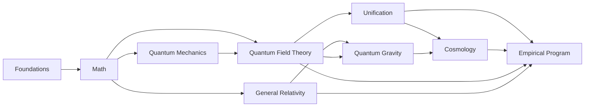

Here’s a compact Requirements Traceability Matrix (RTM) starter for sections 1–9. Each row is a decidable unit: you can prove it, build it, or kill it.

# RTM v0.1 — Sections 1–9

| ID          | Claim (short)                                 | Requirement (what must be shown)                                         | Method (how)                                       | Observable / Test                                         | Falsifier (kill)                                      | Dependencies                     | Status/Risk   |
| ----------- | --------------------------------------------- | ------------------------------------------------------------------------ | -------------------------------------------------- | --------------------------------------------------------- | ----------------------------------------------------- | -------------------------------- | ------------- |
| FND-AXIOMS  | Core axioms + ontology/epistemology are fixed | List axioms; prove consistency + non-redundancy; specify epistemic scope | Axiom set + meta-theorems; conservative extensions | Internal model existence; definitional equivalence checks | Inconsistency or hidden circularity                   | —                                | [NOT STARTED] |
| FND-SYMM    | Primitive symmetries the theory must respect  | State symmetry group(s) and action on primitives                         | Group action on state space; invariants            | Noether-type conservation at low levels                   | Symmetry-breaking at primitives without mechanism     | FND-AXIOMS                       | [NOT STARTED] |
| FND-SPACE   | Spacetime is 3+1 (explain extras if any)      | Derive/justify 3+1; specify extra-dim regime & compactification          | Stability/anthropic/stochastic arguments; EFT      | Predict KK modes / deviation scales                       | Non-observation within predicted windows              | FND-AXIOMS, FND-SYMM             | [NOT STARTED] |
| FND-ENTS    | Fundamental entities are well-defined         | Specify carriers (fields/quasiparticles/walkers); algebra                | Algebraic presentation; state space & observables  | Operational mapping exists (see MEAS-OPS)                 | No consistent observable algebra                      | FND-AXIOMS                       | [NOT STARTED] |
| MTH-GROUPS  | Lorentz/Poincaré/Conformal scaffolds fixed    | Define groups, reps, Casimirs; particle classification                   | Rep theory; Lie algebra generators                 | Correct mass–spin spectra; invariant two-point forms      | Violation of microcausality/unitarity in induced reps | FND-SYMM                         | [NOT STARTED] |
| MTH-ALG     | Algebraic backbone chosen                     | Choose Lie/Clifford/associative/non-commutative pieces                   | Structure constants; *-algebras                    | Consistent comp rules across sectors                      | Anomaly-like inconsistencies at algebra level         | FND-ENTS                         | [NOT STARTED] |
| MTH-DIFFGEO | Diff. geometry + bundles in place             | Charts, tangent/cotangent, connections, curvature                        | Principal/assoc. bundles; Ehresmann connection     | Gauge curvature = field strength mapping                  | Ill-defined connection/curvature under transitions    | FND-SPACE                        | [NOT STARTED] |
| MTH-CAT     | Category-theoretic layer usable               | Categories/functors/natural transformations relevant                     | Functorial symmetries/dualities; limits/colimits   | Duality invariants preserved                              | Contradictions with physical equivalences             | FND-SYMM                         | [NOT STARTED] |
| MTH-TENSOR  | Tensor formalism complete                     | Indices, contraction, covariant derivatives                              | Component + abstract index calculus                | Coordinate/gauge invariants match                         | Gauge/coord dependence leaks into observables         | FND-SPACE                        | [NOT STARTED] |
| QM-HILBERT  | QM base: states/ops/POVM/Born rule            | Hilbert-space postulates; measurement back-action                        | C*-algebra / POVM formalism                        | Frequencies match Born limits                             | Empirical deviation from POVM predictions             | MTH-ALG, MTH-TENSOR              | [NOT STARTED] |
| QM-DECO     | Classical emergence via decoherence           | Pointer states; einselection; classical limit                            | Open-systems master equations                      | Decoherence rates; Loschmidt echo                         | Robust interference where suppression predicted       | QM-HILBERT                       | [NOT STARTED] |
| QM-CHAOS    | Quantum chaos handled                         | Scars/localization/ergodicity criteria                                   | Semiclassical (Gutzwiller), RMT links              | Spectral stats; scar observables                          | Persistent mismatch to RMT universality class         | QM-HILBERT, MTH-GROUPS           | [NOT STARTED] |
| QM-INTERP   | Coherent interpretation fixed                 | State axioms picking QM uniquely or variant                              | Reconstructions; GPT comparisons                   | No Dutch-book/decision violations                         | Internal contradiction with dynamics                  | QM-HILBERT, MTH-CAT              | [NOT STARTED] |
| QM-TESTS    | Foundational tests extended                   | Contextuality/macrorealism consistency                                   | KS/LG/Wigner-friend protocols                      | Loophole-free inequalities                                | Violations outside predicted cones                    | QM-HILBERT                       | [NOT STARTED] |
| QFT-AXIOMS  | QFT baseline consistent                       | Fields/Lagrangians; locality; positivity                                 | Wightman/Haag–Kastler; OS positivity               | Reconstruct Wightman from OS; spectrum cond.              | Failure of reflection positivity or locality          | MTH-GROUPS, MTH-ALG, MTH-DIFFGEO | [NOT STARTED] |
| QFT-RENORM  | RG, Ward/Slavnov–Taylor hold                  | Renorm. scheme independence; identities                                  | BPHZ/MS; BRST cohomology                           | Scheme-invariant β, γ; conserved currents                 | Anomalous breaking where forbidden                    | QFT-AXIOMS, MTH-ALG              | [NOT STARTED] |
| QFT-NONPERT | Nonperturbative control exists                | Continuum extrapolation & resurgent control                              | Lattice; FRG; Borel/transseries                    | Scale setting; universality checks                        | Lattice result contradicts continuum limit            | QFT-AXIOMS                       | [NOT STARTED] |
| QFT-YM      | Mass gap & confinement resolved               | Existence of gap; confinement mechanism                                  | Lattice proofs/bounds; flux-tube EFT               | Hadron spectra; string tension                            | Absence of gap under stated axioms                    | QFT-NONPERT, QFT-RENORM          | [NOT STARTED] |
| GR-BASIS    | GR core equations fixed                       | Metric, curvature, geodesics, Tμν                                        | Variational derivation; ADM                        | Classic tests (perihelion, light bending)                 | Systematic deviation beyond bounds                    | MTH-DIFFGEO, FND-SPACE           | [NOT STARTED] |
| GR-SING     | Singularities & censorship handled            | Theorems or evasion mechanism                                            | Penrose/Hawking or modified dynamics               | Censorship-compatible signatures                          | Generic naked singularities without control           | GR-BASIS                         | [NOT STARTED] |
| GR-TESTS    | Precision gravity passed                      | PPN, EP, GW pol., dispersion                                             | PPN fit; atom interferometry; LIGO/Virgo/KAGRA     | Bounds within margins                                     | Reproducible violation of EP/PPN                      | GR-BASIS                         | [NOT STARTED] |
| UNI-EW      | Electroweak unification recovered             | SU(2)×U(1) breaking + couplings                                          | Higgs sector/EFT matching                          | Precision EW (LEP/LHC)                                    | Coupling pattern mismatch                             | QFT-RENORM                       | [NOT STARTED] |
| UNI-QCD     | QCD sector matched                            | SU(3) confinement/ΛQCD                                                   | Lattice + chiral EFT                               | Hadron masses/form factors                                | Inconsistent form-factor systematics                  | QFT-YM                           | [NOT STARTED] |
| UNI-GUT     | GUT candidate consistent                      | Group (SU5/SO10/…) + proton lifetime                                     | RG unification; threshold corr.                    | p→e+π0 bounds; coupling meeting                           | Excluded lifetime/couplings                           | UNI-EW, UNI-QCD                  | [NOT STARTED] |
| UNI-CP      | Strong CP resolved                            | θ≈0 mechanism (axion/…)                                                  | PQ symmetry; axion EFT                             | Axion haloscopes/helioscopes                              | Null in stated reach                                  | QFT-RENORM                       | [NOT STARTED] |
| UNI-NEUT    | Neutrino masses mechanism                     | Dirac/Majorana + seesaw                                                  | PMNS fit; LNV operators                            | 0νββ; oscillation params                                  | Incompatible hierarchy/phase                          | QFT-RENORM, UNI-GUT              | [NOT STARTED] |
| UNI-FLAVOR  | Flavor structure explained                    | Mass/mixing patterns from symmetry                                       | FN/U(2)/modular flavor                             | Rare decays; CPV                                          | Absence of predicted deviations                       | UNI-NEUT, UNI-GUT                | [NOT STARTED] |
| QG-UNIT     | Quantum spacetime is consistent               | UV completion or safe EFT                                                | Asymp. safety, strings, LQG, causal sets           | Low-energy limit agrees                                   | Non-unitary/ill-defined limit                         | QFT-AXIOMS, GR-BASIS             | [NOT STARTED] |
| QG-BHINFO   | Info paradox resolved                         | Page-curve/unitarity shown                                               | Islands/replicas or unitary S-matrix               | Entropy flow; analog tests                                | Irreducible loss under assumptions                    | QG-UNIT                          | [NOT STARTED] |
| QG-TIME     | Time problem addressed                        | Dynamics with emergent/relational time                                   | Wheeler–DeWitt; relational observables             | Gauge-invariant clock tests                               | Inconsistency across slicings                         | QG-UNIT                          | [NOT STARTED] |
| QG-PATH     | Grav. path integral defined                   | Measure/BRST/BV well-posed                                               | Gauge fixing; ghosts                               | Gauge-indep. obs.                                         | Gribov-type obstruction uncontrolled                  | QG-UNIT, MTH-DIFFGEO             | [NOT STARTED] |
| QG-OBS      | Diffeo-invariant observables exist            | Dirac/partial obs. construction                                          | Relational structures                              | Slice-indep. values                                       | Observable algebra inconsistency                      | QG-UNIT                          | [NOT STARTED] |
| COS-INFL    | Inflation or alternative fixed                | Mechanism + spectra                                                      | EFT of inflation; alternatives                     | ns, r, fNL, isocurvature                                  | Disagreement with Planck/next-gen                     | QFT-RENORM, GR-BASIS             | [NOT STARTED] |
| COS-DM      | Dark matter model nailed                      | Candidate + scales + halo small-scale                                    | WIMPs/axions/SIDM/…                                | Direct/indirect/lensing; cores/sats                       | Joint exclusion vs structure                          | UNI/QFT-NONPERT                  | [NOT STARTED] |
| COS-DE      | Dark energy/Λ explained                       | CC value or dynamics                                                     | Vacuum calc / quintessence                         | H0/S8 + w(z)                                              | Tension persists beyond model                         | GR-TESTS, QFT-RENORM             | [NOT STARTED] |
| COS-ASYM    | Baryon asymmetry predicted                    | Mechanism + ηB                                                           | EWBG/leptogenesis                                  | ηB from CMB/BBN                                           | Incompatible CPV/efficiency                           | UNI-NEUT, COS-INFL               | [NOT STARTED] |
| COS-PREC    | Precision cosmology passes                    | Joint BBN/CMB/BAO fits                                                   | Global inference pipeline                          | Consistent posteriors                                     | Stable residuals outside noise                        | COS-*                            | [NOT STARTED] |
| EXP-SPECTRA | Particle spectra derived                      | Masses/quantum numbers                                                   | EFT + symmetry                                     | Cross-sections/branching                                  | Persistent mismatch                                   | UNI-*, QFT-*                     | [NOT STARTED] |
| EXP-RARE    | New phenomena windows set                     | Monopoles/axions/proton decay                                            | Detector proposals + limits                        | Exclusion or discovery                                    | Contradiction across channels                         | UNI-GUT, UNI-CP                  | [NOT STARTED] |
| EXP-VIOL    | Symmetry-violation bounds                     | CPT/Lorentz/BNV/LNV                                                      | SME/EFT tests                                      | Laboratory/astro limits                                   | Incompatible null/pos results                         | MTH-GROUPS, QFT-AXIOMS           | [NOT STARTED] |
| EXP-COLL    | Collider program defined                      | Signatures + cuts + stats                                                | MC + EFT fits                                      | Run plans + sensitivities                                 | Null against predicted reach                          | EXP-SPECTRA                      | [NOT STARTED] |
| EXP-ASTR    | Astro/cosmo program defined                   | Telescopes + targets + stats                                             | Multi-messenger strategy                           | Joint-likelihood constraints                              | Tension with lab sector                               | COS-*, UNI-*                     | [NOT STARTED] |

# High-level dependency map

# How to work this board

* Treat each ID as a ticket. A ticket is “done” only with a proof/derivation, an algorithm with bounds, or a prediction + discriminating test.
* When you start an item, append a brief log (“[STARTED] — approach, blockers, next proof lemmas”), then promote to “[DONE]” when the requirement is satisfied. If assumptions are brittle, mark “[DONE*]” and list fragilities.

Next step from here: I can drop this RTM into a filterable CSV/Notion schema or a canvas board and pre-wire dependency views, then expand 10–12 “most central” tickets (the ones feeding the most arrows) with acceptance tests and initial lemmas.
