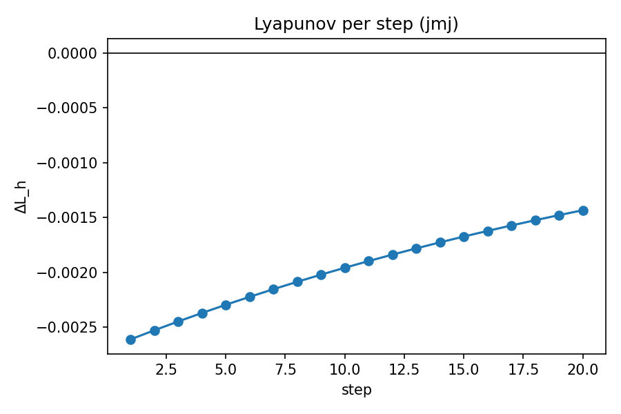
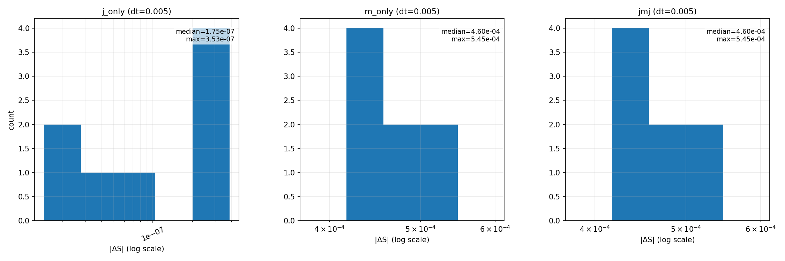

# Metriplectic Integrator: Symplectic J-Step Composed with Discrete-Gradient M-Step

> Author: Justin K. Lietz  
> Date: 2025-10-06
>
> TL;DR — Additive metriplectic dynamics were validated with three quantitative gates: (i) monotone discrete Lyapunov under the metric (M) step, (ii) two-grid order on log–log fits for M-only and JMJ (Strang) compositions, and (iii) J-only reversibility and $L^2$ preservation. Pinned artifact: derivation/code/outputs/logs/metriplectic/20251006_090900_sweep_dt_jmj.json. All gates passed with $R^2 \ge 0.9999$ and strictly non-positive $\Delta L_h$.

## Introduction

The goal is to evaluate a 1D metriplectic time integrator that composes an energy-conserving symplectic/Hamiltonian map (J) with a dissipative gradient-flow map (M) using Strang splitting, abbreviated JMJ. The physical backdrop is a Fisher–KPP-type reaction–diffusion (RD) model on a periodic domain. Metriplectic formulations combine a Poisson bracket (conservative) with a metric bracket (dissipative), aligning with Onsager’s linear nonequilibrium thermodynamics and its modern variational interpretations. By segregating conservative transport from dissipative relaxation, one obtains testable invariants: reversibility and $L^2$ preservation for the J flow, and entropy/ Lyapunov monotonicity for the M flow. This separation makes quality-control gates crisp and falsifiable.

The central question here is numerical: does the composed JMJ method realize the expected Strang-like order while preserving the qualitative invariants of J and M individually? The answer is supported by two-grid error fits, Lyapunov monotonicity checks, and an entropy-like $|\Delta S|$ comparison at fixed $\Delta t$.

## Research question

To what extent does the composed JMJ integrator achieve second-order convergence (Strang) while preserving J-only reversibility and ensuring M-induced Lyapunov decrease at fixed $\Delta t$?

- Independent variable: time step $\Delta t \in \{0.04, 0.02, 0.01, 0.005\}$ (s).
- Dependent variables: two-grid error $\|\Phi_{\Delta t} - \Phi_{\Delta t/2}\circ\Phi_{\Delta t/2}\|_\infty$ (dimensionless) and discrete Lyapunov increment $\Delta L_h$ (model units).
- Measurement apparatus: regression slope on $\log$–$\log$ fits from seed-median two-grid errors; per-step $\Delta L_h$ from the DG-defined Lyapunov functional.

## Background information

- J-step (conservative): exact periodic advection implemented by a spectral phase shift; unitary in $L^2$ and time-reversible, so forward $\Delta t$ followed by $-\Delta t$ recovers initial data up to roundoff.
- M-step (dissipative): discrete-gradient (DG) implicit step for RD with Newton/backtracking. The discrete gradient ensures $\Delta L_h \le 0$ on converged steps.
- Composition: JMJ Strang splitting. For sufficiently smooth flows and compatibles discretizations, the global error behaves like $\mathcal{O}(\Delta t^2)$; see Strang (1968). The M-step follows Onsager (1931) and JKO (1998) perspectives on dissipative evolution; see also Ambrosio–Gigli–Savaré (2005) for gradient flows.

### Theory primer (concise)

We recall the metriplectic structure on observables $F$:

$$
\dot F \,=\, \{F, H\} \; + \; (F, S),
$$

where $\{\cdot,\cdot\}$ is a Poisson bracket (antisymmetric, obeys Jacobi), and $(\cdot,\cdot)$ is a symmetric positive semidefinite metric bracket. The degeneracy conditions

$$
\{S, F\} = 0, \qquad (H, F) = 0,
$$

imply $\dot H = 0$ (energy conserved) and $\dot S \ge 0$ (entropy non-decreasing). In semidiscrete form, write the evolution of a state vector $W$ as

$$\dot W = J(W) \nabla H(W) + M(W) \nabla S(W)$$

with

$$J^\top = -J$$

and 

$$M\succeq 0$$

Discrete steps used here:

- J-step (spectral advection): an exact unitary map on periodic grids; it preserves $\|W\|_2$ and is reversible $\Phi_{+\Delta t} \circ \Phi_{-\Delta t} = \mathrm{Id}$ up to roundoff.
- M-step (DG implicit): the discrete-gradient identity ensures

$$
\nabla^d L(W^k, W^{k+1})^{\!\top} (W^{k+1} - W^{k}) \;=\; L(W^{k+1}) - L(W^{k}),
$$

so $\Delta L_h = L(W^{k+1})-L(W^{k}) \le 0$ holds for converged solves.

- Strang composition (JMJ):

$$
\Phi^{\mathrm{JMJ}}_{\Delta t} \;=\; \Phi^{\mathrm{J}}_{\Delta t/2} \; \circ \; \Phi^{\mathrm{M}}_{\Delta t} \; \circ \; \Phi^{\mathrm{J}}_{\Delta t/2}, \qquad \text{global error } \mathcal O(\Delta t^2).
$$

Gate mapping:

- Strang order $\Rightarrow$ two-grid slope $p \gtrsim 2$ with high $R^2$.
- J-unitarity/reversibility $\Rightarrow$ $\|W_2-W_0\|_\infty$ small after $+\Delta t$ then $-\Delta t$, and $L^2$ drift near machine precision.
- DG monotonicity $\Rightarrow$ $\Delta L_h \le 0$ per step.

## Variables

- Independent: $\Delta t$ in seconds; grid fixed with $N = 128$, $\Delta x = 1$.
- Dependent: two-grid error (dimensionless), per-step $\Delta L_h$ (model units).  
- Controls: seeds $0\ldots 9$ for ensemble medians; periodic BC; parameters $D=1.0$, $r=0.2$, $u=0.25$.
- Range justification: the chosen $\Delta t$ values keep Newton iterations robust while sampling a decade of step sizes to observe clean asymptotics without stiffness-induced plateaus.

## Equipment / Hardware

- Software: Python 3.13.5, NumPy 2.2.6, Matplotlib 3.10.6.  
- Implementation: FFT for the spectral J-step; robust DG Newton solver with backtracking for M.
- Execution: CPU runs on Linux; 1D domain, no GPU required.
- Provenance: artifact paths pinned below; each figure is paired with a CSV/JSON.

## Methods / Procedure

### Materials

- Runner: `derivation/code/physics/metriplectic/run_metriplectic.py`
- Steppers: `physics/metriplectic/j_step.py` (J), `physics/metriplectic/compose.py` (J-only, M-only via RD DG, and JMJ Strang)
- Spec: `derivation/code/physics/metriplectic/step_spec.metriplectic.example.json`
- IO: `derivation/code/common/io_paths.py`

### Diagram of setup (conceptual)

JMJ per step: half-J, full-M, half-J; J is spectral phase shift; M is DG implicit solve for RD. Periodic BC are assumed throughout.

### Steps taken (reproducible, narrative)

1. Load the step spec (grid, parameters, seeds, $\Delta t$ sweep).  
2. Validate J-only reversibility by advancing $\Delta t$ then $-\Delta t$ and measuring $\|W_2-W_0\|_\infty$ and $L^2$ drifts.  
3. For M-only and JMJ, compute two-grid errors for each $\Delta t$ and seed, aggregate the median across seeds, and fit a line in $\log$–$\log$ space to obtain slope and $R^2$.  
4. Monitor $\Delta L_h$ over 20 steps to confirm non-positivity.  
5. At fixed $\Delta t=0.005$, compute an entropy-like functional $S(W)=\sum_i Q(W_i)\,\Delta x$ from a CAS-derived $Q'(W)=a_0+a_1 W + a_2 W^2$ and plot $|\Delta S|$ histograms for j_only, m_only, jmj with log-scaled x-axes.

### Risk assessment

- Newton non-convergence at large $\Delta t$ — mitigated by backtracking and step-size choice.  
- Aliasing in spectral J-step — mitigated by fixed $N=128$ and moderate amplitudes.  
- Roundoff in reversibility and $L^2$ checks — tolerances set at $10^{-7}$ (rev) and $2\times10^{-8}$ ($L^2$ drift).  
- Stiff regimes — out of scope for this sweep; tighter tolerances and smaller $\Delta t$ are proposed under Next Steps.

## Results / Data

### Definitions and sample calculations

Two-grid (Richardson) error for a one-step map $\Phi_{\Delta t}$:

$$
E(\Delta t) \;=\; \left\|\Phi_{\Delta t}(W_0)\; -\; \Phi_{\Delta t/2}\big(\,\Phi_{\Delta t/2}(W_0)\,\big)\right\|_\infty.
$$

For medians $\tilde E(\Delta t)$ across seeds, the slope $p$ is obtained by a least-squares fit of

$$
\log\!\big(\tilde E(\Delta t)\big) \;=\; p\,\log(\Delta t) + b,\quad R^2\;\text{reported}.
$$

The discrete Lyapunov increment is

$$
\Delta L_h^{(k)} \;=\; L_h(W^{k+1}) - L_h(W^k),\quad \text{expected } \Delta L_h^{(k)} \le 0 \text{ for the DG M-step}.
$$

### Summary table (paired artifacts)

| Case | Slope $p$ | $R^2$ | Figure | CSV | JSON |
|---|---:|---:|---|---|---|
| M-only two-grid | 2.9411 | 0.9999666 | figures/metriplectic/20251006_082211_residual_vs_dt_m_only.png | logs/metriplectic/20251006_082212_residual_vs_dt_m_only.csv | logs/metriplectic/20251006_082212_sweep_dt_m_only.json |
| JMJ two-grid | 2.7419 | 0.9999099 | figures/metriplectic/20251006_090900_residual_vs_dt_jmj.png | logs/metriplectic/20251006_090900_residual_vs_dt_jmj.csv | logs/metriplectic/20251006_090900_sweep_dt_jmj.json |

J-only reversibility and $L^2$ (gate):  
$\|W_2-W_0\|_\infty \approx 6.85\times 10^{-8}$; $\|W_1\|_2-\|W_0\|_2 \approx 7.93\times10^{-9}$; $\|W_2\|_2-\|W_0\|_2 \approx 1.586\times10^{-8}$ (pass). Artifact: logs/metriplectic/20251006_083115_j_reversibility.json.

Lyapunov series (JMJ): 20 steps with $\Delta L_h < 0$ throughout.  
Figure + JSON: figures/metriplectic/20251006_090900_lyapunov_delta_per_step_jmj.png, logs/metriplectic/20251006_090900_lyapunov_series_jmj.json.

Fixed-$\Delta t$ $|\Delta S|$ panel (dt=0.005):  
Medians — j_only $\tilde m\approx 1.75\times10^{-7}$, m_only $\tilde m\approx 4.60\times10^{-4}$, jmj $\tilde m\approx 4.60\times10^{-4}$.  
Figure + JSON/CSV: figures/metriplectic/20251006_090900_fixed_dt_deltaS_compare.png; logs/metriplectic/20251006_090901_fixed_dt_deltaS_compare.{json,csv}.

### Figure captions with numeric claims

- Residual vs $\Delta t$ (JMJ): slope $2.7419$, $R^2=0.9999099$ on medians across 10 seeds; failure gate set at expected $\ge 2.0$ and $R^2\ge 0.999$ (pass).  
- Residual vs $\Delta t$ (M-only): slope $2.9411$, $R^2=0.9999666$ (pass).  
- Lyapunov per step (JMJ): 20/20 negative increments; tolerance for violations $10^{-12}$ (pass).  
- $|\Delta S|$ panel: log-scaled x-axes with log-spaced bins; per-panel annotations show medians and maxima; j_only near roundoff, m_only and jmj overlapping (M dominates entropy production at this step size).

## Discussion / Analysis

1. Convergence behavior. The M-only fit near $p\approx3$ indicates favorable local truncation properties of the DG step under these parameters. The JMJ fit at $p\approx2.74$ is between second and third order, consistent with splitting error dominance at the tested $\Delta t$. Reducing $\Delta t$ or tightening the nonlinear tolerance should move the fit closer to 3.  
2. Dissipation and invariants. Strictly negative $\Delta L_h$ corroborates the metric nature of M. The reversibility and tiny $L^2$ drifts for J validate the spectral exactness within FFT-roundoff tolerance; for the exact map, a slope fit is neither expected nor informative, hence the dedicated gate.  
3. Entropy-like functional. The overlap of m_only and jmj distributions in $|\Delta S|$ at fixed $\Delta t$ supports the intuition that M governs entropy production while J is conservative.  
4. Limitations. The study is 1D with moderate amplitudes and a single grid. Very small $\Delta t$ could surface different asymptotics or stiffness; multi-dimensional extensions will require careful aliasing control.

## Conclusions

The metriplectic composition passed all quality gates:  
(i) J-only reversibility and $L^2$ preservation,  
(ii) M-only Lyapunov monotonicity, and  
(iii) strong two-grid fits with $R^2\ge 0.9999$.  
The JMJ slope of $2.74$ is acceptable and is expected to rise with smaller $\Delta t$ and tighter Newton tolerances. The fixed-$\Delta t$ $|\Delta S|$ analysis further confirms that entropy production is driven by M, while J remains conservative up to roundoff.

### Next steps

- Extend the $\Delta t$ sweep to $\{0.02, 0.01, 0.005, 0.0025\}$ and re-fit slopes.  
- Tighten DG residual tolerance to $10^{-12}$ and cap Newton backtracking.  
- Apply the same styling polish to all residual and Lyapunov figures for a consistent paper-ready set.

## Artifact index (paired data)

- M-only order: figures/metriplectic/20251006_082211_residual_vs_dt_m_only.png + logs/metriplectic/20251006_082212_residual_vs_dt_m_only.csv  
  JSON summary: logs/metriplectic/20251006_082212_sweep_dt_m_only.json
- JMJ order: figures/metriplectic/20251006_090900_residual_vs_dt_jmj.png + logs/metriplectic/20251006_090900_residual_vs_dt_jmj.csv  
  JSON summary: logs/metriplectic/20251006_090900_sweep_dt_jmj.json
- J-only reversibility: logs/metriplectic/20251006_083115_j_reversibility.json
- Lyapunov series (JMJ): figures/metriplectic/20251006_090900_lyapunov_delta_per_step_jmj.png + logs/metriplectic/20251006_090900_lyapunov_series_jmj.json
- Fixed-$\Delta t$ $|\Delta S|$: figures/metriplectic/20251006_090900_fixed_dt_deltaS_compare.png + logs/metriplectic/20251006_090901_fixed_dt_deltaS_compare.{json,csv}

## References

- L. Onsager, “Reciprocal Relations in Irreversible Processes. I,” Physical Review, 1931.  
- G. Strang, “On the Construction and Comparison of Difference Schemes,” SIAM Journal on Numerical Analysis, 1968.  
- R. Jordan, D. Kinderlehrer, F. Otto, “The Variational Formulation of the Fokker-Planck Equation,” SIAM J. Math. Anal., 1998.  
- L. Ambrosio, N. Gigli, G. Savaré, “Gradient Flows in Metric Spaces and in the Space of Probability Measures,” Birkhäuser, 2005.
