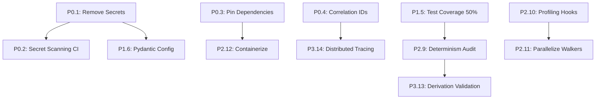

# Refactor Plan & Technical Roadmap

**Repository**: Prometheus_VDM  
**Commit**: ae49a391acf2183242e4d96bda49e066beec7680  
**Planning Date**: 2025-01-25

---

## PRIORITIZATION FRAMEWORK

| Priority | Criteria | Timeline |
|----------|----------|----------|
| **P0 (Critical)** | Security vulnerabilities, data loss risks, blocking production | Immediate (1-3 days) |
| **P1 (High)** | Observability gaps, config fragmentation, testing | Short-term (1-2 weeks) |
| **P2 (Medium)** | Performance, scalability, maintainability | Medium-term (1-2 sprints) |
| **P3 (Low)** | Documentation, UX improvements, refactoring debt | Long-term (3+ months) |

---

## QUICK WINS (P0: 1-3 Days)

### 1. **Remove Secrets from Git History** [CRITICAL]
**Issue**: `.env` and `.env.local` committed with potential credentials  
**Impact**: HIGH - Public repo exposure  
**Effort**: 4 hours  
**Owner**: Security Lead

**Steps**:
```bash
# 1. Remove from git history
git filter-repo --path .env --invert-paths
git filter-repo --path .env.local --invert-paths

# 2. Add to .gitignore
echo ".env*" >> .gitignore
git add .gitignore
git commit -m "Add .env* to .gitignore"

# 3. Force push (coordinate with team)
git push --force-with-lease
```

**Validation**:
- Run `gitleaks detect --source .` → no secrets found
- Verify `.env*` in `.gitignore`
- Rotate all keys previously in `.env`

---

### 2. **Add Secret Scanning to CI** [CRITICAL]
**Issue**: No automated secret detection  
**Impact**: HIGH - Ongoing leakage risk  
**Effort**: 2 hours  
**Owner**: DevOps

**Implementation**:
```yaml
# .github/workflows/secrets.yml
name: Secret Scanning
on: [push, pull_request]
jobs:
  gitleaks:
    runs-on: ubuntu-latest
    steps:
      - uses: actions/checkout@v3
        with:
          fetch-depth: 0
      - uses: gitleaks/gitleaks-action@v2
```

**Validation**: Push test commit with fake secret → CI fails

---

### 3. **Pin Dependencies** [CRITICAL]
**Issue**: Unpinned requirements.txt → reproducibility risk  
**Impact**: MEDIUM - Build breakage  
**Effort**: 2 hours  
**Owner**: Build Engineer

**Steps**:
```bash
# Generate lock file
pip-compile requirements.txt -o requirements-lock.txt

# Update CI to use lock file
sed -i 's/requirements.txt/requirements-lock.txt/' .github/workflows/*.yml

# Document in README
echo "Use: pip install -r requirements-lock.txt" >> README.md
```

**Validation**: Fresh venv install → versions match

---

### 4. **Add Run Correlation ID** [HIGH]
**Issue**: No correlation ID in logs → cannot trace across events  
**Impact**: MEDIUM - Debugging difficulty  
**Effort**: 4 hours  
**Owner**: Platform Engineer

**Implementation**:
```python
# vdm_rt/runtime/state.py
import uuid

class RuntimeState:
    def __init__(self, ...):
        self.run_id = str(uuid.uuid4())  # Generate once per run
        
# vdm_rt/utils/logging_setup.py
def get_logger(name, jsonl_path, run_id=None):
    # Add run_id to all log records
    logger.extra = {"run_id": run_id}
```

**Validation**: Check events.jsonl → all events have `run_id` field

---

## SHORT-TERM (P1: 1-2 Weeks)

### 5. **Expand Test Coverage to 50%** [HIGH]
**Issue**: <15% coverage → high regression risk  
**Impact**: HIGH - Production readiness  
**Effort**: 2 weeks  
**Owner**: QA + Dev Team

**Approach**:
1. **Week 1: Core Domain Tests** (Target: 40% core coverage)
   - Property-based tests (Hypothesis):
     - `test_connectome_invariants.py`: k-connectivity, weight bounds
     - `test_neuroplasticity_commutativity.py`: GDSP/RevGSP order-independence
   - Integration tests:
     - `test_full_run.py`: Init → 100 ticks → checkpoint → resume
   - Regression tests:
     - `test_golden_runs.py`: Convert `tools/golden_run_parity.py` to pytest

2. **Week 2: Infrastructure Tests** (Target: 50% io/runtime coverage)
   - Checkpoint I/O: `test_engram_io_roundtrip.py`
   - Config loading: `test_profile_loading.py` (all run_profiles/*.json)
   - Telemetry: `test_utd_logging.py`

**Validation**:
```bash
pytest --cov=vdm_rt --cov-report=term --cov-report=html
# Check htmlcov/index.html → ≥50%
```

---

### 6. **Consolidate Configuration to Pydantic** [HIGH]
**Issue**: Fragmented config (argparse + JSON + .env)  
**Impact**: MEDIUM - Validation gaps, env pollution  
**Effort**: 1 week  
**Owner**: Platform Engineer

**Steps**:
1. Create `vdm_rt/config.py`:
```python
from pydantic import BaseSettings, Field, validator
from pathlib import Path

class VDMConfig(BaseSettings):
    # Runtime
    N: int = Field(1000, ge=10, le=1_000_000, description="Neurons")
    k: int = Field(12, ge=1, le=100, description="Edges per neuron")
    hz: int = Field(10, ge=1, le=1000, description="Ticks per second")
    seed: int = Field(0, ge=0, description="RNG seed")
    
    # I/O
    run_dir: Path = Field(Path("runs"), description="Run artifacts dir")
    runs_root: Path = Field(Path("runs"), description="Runs root for dashboard")
    
    # Feature flags
    force_dense: bool = Field(False, env="FORCE_DENSE")
    enable_event_metrics: bool = Field(True, env="ENABLE_EVENT_METRICS")
    
    @validator('run_dir', 'runs_root')
    def paths_must_exist_or_creatable(cls, v):
        v.mkdir(parents=True, exist_ok=True)
        return v
    
    class Config:
        env_prefix = "VDM_"
        env_file = ".env"
        env_file_encoding = "utf-8"
```

2. Refactor entrypoints:
```python
# run_nexus.py
config = VDMConfig()  # Auto-loads from env + .env + CLI overrides
nexus = Nexus.from_config(config)
```

3. Deprecate old argparse (gradual migration)

**Validation**:
- All run_profiles/*.json validate against schema
- CLI overrides work: `VDM_N=2000 python run_nexus.py` → N=2000

---

### 7. **Add Checkpoint Content-Addressability** [MEDIUM]
**Issue**: Checkpoints lack SHA256 hash → no tamper detection  
**Impact**: MEDIUM - Provenance integrity  
**Effort**: 3 days  
**Owner**: Core Dev

**Implementation**:
```python
# vdm_rt/core/memory/engram_io.py
import hashlib

def save_engram(connectome, path, format='h5'):
    # ... existing save logic ...
    
    # Compute SHA256 of weights + bias
    hasher = hashlib.sha256()
    hasher.update(connectome.w.tobytes())
    hasher.update(connectome.b.tobytes())
    content_hash = hasher.hexdigest()
    
    # Add to metadata
    f.attrs['content_sha256'] = content_hash
    f.attrs['provenance_manifest_commit'] = get_git_commit()

def load_engram(path, connectome):
    # ... existing load logic ...
    
    # Verify hash
    expected_hash = f.attrs.get('content_sha256')
    if expected_hash:
        actual_hash = compute_hash(connectome)
        assert actual_hash == expected_hash, "Checkpoint tampered!"
```

**Validation**: Corrupt checkpoint → load fails with hash mismatch

---

### 8. **Add Health Check Endpoints** [HIGH]
**Issue**: No standard /health, /readiness, /liveness  
**Impact**: MEDIUM - Deployment orchestration  
**Effort**: 2 days  
**Owner**: SRE

**Implementation**:
```python
# vdm_rt/runtime/helpers/health_server.py
from flask import Flask, jsonify
import threading

app = Flask(__name__)
_state = {"healthy": True, "ready": False, "tick": 0}

@app.route("/health")
def health():
    return jsonify({"status": "ok" if _state["healthy"] else "error"}), 200 if _state["healthy"] else 503

@app.route("/readiness")
def readiness():
    return jsonify({"ready": _state["ready"]}), 200 if _state["ready"] else 503

@app.route("/liveness")
def liveness():
    # Check if tick updated in last 60s
    import time
    if time.time() - _state["last_tick_time"] > 60:
        return jsonify({"alive": False}), 500
    return jsonify({"alive": True, "tick": _state["tick"]}), 200

def start_health_server(state_ref):
    global _state
    _state = state_ref
    threading.Thread(target=lambda: app.run(port=8080, host="0.0.0.0"), daemon=True).start()
```

**Validation**: `curl localhost:8080/health` → 200 OK

---

## MEDIUM-TERM (P2: 1-2 Sprints)

### 9. **Deterministic Seeding Audit** [MEDIUM]
**Issue**: No guarantee that same seed → identical trajectory  
**Impact**: MEDIUM - Reproducibility claims  
**Effort**: 1 sprint  
**Owner**: Research Engineer

**Steps**:
1. Audit all RNG usage:
   ```bash
   grep -r "random\|torch\.rand\|np\.random" vdm_rt/ | grep -v "seed("
   ```
2. Enforce seeding in all modules:
   ```python
   # vdm_rt/core/__init__.py
   def set_global_seed(seed):
       import random, numpy as np
       random.seed(seed)
       np.random.seed(seed)
       try:
           import torch
           torch.manual_seed(seed)
           torch.cuda.manual_seed_all(seed)
       except ImportError:
           pass
   ```
3. Add golden run tests:
   ```python
   # tests/test_determinism.py
   def test_same_seed_identical_output():
       config1 = VDMConfig(seed=42, N=100, duration_s=1)
       config2 = VDMConfig(seed=42, N=100, duration_s=1)
       
       output1 = run_nexus(config1)
       output2 = run_nexus(config2)
       
       assert output1.final_checkpoint == output2.final_checkpoint
   ```

**Validation**: pytest → determinism test passes

---

### 10. **Add Performance Profiling Hooks** [MEDIUM]
**Issue**: No profiling instrumentation → blind optimization  
**Impact**: MEDIUM - Performance tuning  
**Effort**: 1 sprint  
**Owner**: Performance Engineer

**Implementation**:
```python
# vdm_rt/utils/profiling.py
import cProfile
import pstats
from contextlib import contextmanager

@contextmanager
def profile_context(output_path=None):
    profiler = cProfile.Profile()
    profiler.enable()
    try:
        yield profiler
    finally:
        profiler.disable()
        if output_path:
            profiler.dump_stats(output_path)
        stats = pstats.Stats(profiler)
        stats.sort_stats('cumulative')
        stats.print_stats(20)

# Usage in run_nexus.py
if os.getenv("VDM_PROFILE"):
    with profile_context("profile.pstats"):
        nexus.run(duration_s=60)
```

**Add to CI**:
```bash
# benchmark.sh
VDM_PROFILE=1 python run_nexus.py --neurons 1000 --duration 10
snakeviz profile.pstats  # Visualize
```

**Validation**: `VDM_PROFILE=1 python run_nexus.py` → profile.pstats generated

---

### 11. **Parallelize Void Walkers** [MEDIUM]
**Issue**: Single-threaded scout execution  
**Impact**: MEDIUM - 3-5x speedup potential  
**Effort**: 1.5 sprints  
**Owner**: Core Dev

**Approach**:
```python
# vdm_rt/core/cortex/void_walkers/runner.py
from joblib import Parallel, delayed

def run_void_walkers(connectome, maps, config, ...):
    # Scouts are embarrassingly parallel
    scout_configs = [
        (HeatScout, heat_config),
        (RayScout, ray_config),
        ...
    ]
    
    results = Parallel(n_jobs=config.num_walker_threads, backend="threading")(
        delayed(run_single_scout)(ScoutClass, cfg, connectome, maps)
        for ScoutClass, cfg in scout_configs
    )
    
    # Aggregate events
    all_events = [e for scout_events in results for e in scout_events]
    return all_events
```

**Validation**: Benchmark → 3x speedup on 8-core CPU

---

### 12. **Containerize Application** [MEDIUM]
**Issue**: No Docker image → manual setup  
**Impact**: MEDIUM - Deployment friction  
**Effort**: 1 sprint  
**Owner**: DevOps

**Deliverables**:
1. `Dockerfile`:
   ```dockerfile
   FROM python:3.11-slim AS base
   RUN apt-get update && apt-get install -y git build-essential
   
   FROM base AS builder
   COPY requirements-lock.txt /tmp/
   RUN pip install --no-cache-dir --user -r /tmp/requirements-lock.txt
   
   FROM base
   COPY --from=builder /root/.local /root/.local
   ENV PATH=/root/.local/bin:$PATH
   COPY vdm_rt /app/vdm_rt
   COPY run_profiles /app/run_profiles
   WORKDIR /app
   CMD ["python", "vdm_rt/run_nexus.py", "--help"]
   ```

2. `docker-compose.yml`:
   ```yaml
   version: '3.8'
   services:
     vdm-runner:
       build: .
       volumes:
         - ./runs:/app/runs
       environment:
         - VDM_N=1000
         - VDM_HZ=10
       command: ["python", "vdm_rt/run_nexus.py", "--profile", "run_profiles/05_10k_fuvdm.json"]
     
     vdm-dashboard:
       build: .
       ports:
         - "8060:8060"
       volumes:
         - ./runs:/app/runs
       command: ["python", "vdm_live.py", "--runs-root", "/app/runs", "--host", "0.0.0.0"]
   ```

**Validation**: `docker-compose up` → dashboard accessible at localhost:8060

---

## STRATEGIC (P3: 3+ Months)

### 13. **Build Derivation→Code Validation Pipeline** [STRATEGIC]
**Issue**: No automated symbolic→numeric consistency checks  
**Impact**: HIGH (long-term) - Research integrity  
**Effort**: 3 months  
**Owner**: Research + Engineering

**Phases**:
1. **Phase 1: SymPy Integration** (4 weeks)
   - Parse TeX equations → SymPy expressions
   - Generate reference Python implementations
   
2. **Phase 2: Auto-Diff Validation** (4 weeks)
   - Use JAX/PyTorch to compute gradients
   - Compare to GDSP/RevGSP implementations
   
3. **Phase 3: CI Gate** (4 weeks)
   - Add `test_derivation_parity.py`
   - Fail CI if symbolic ≠ numeric

**Example**:
```python
# tests/test_derivation_parity.py
import sympy as sp
from vdm_rt.core.Void_Equations import void_debt_field

def test_void_debt_symbolic_vs_numeric():
    # Symbolic
    x, t, psi0 = sp.symbols('x t psi0')
    psi_symbolic = psi0 * sp.exp(-x**2 / (4*t))  # From TeX derivation
    
    # Numeric
    psi_numeric = void_debt_field(x_val=1.0, t_val=1.0, psi0=1.0)
    psi_expected = float(psi_symbolic.subs({x: 1.0, t: 1.0, psi0: 1.0}))
    
    assert abs(psi_numeric - psi_expected) < 1e-6
```

---

### 14. **Distributed Tracing (OpenTelemetry)** [STRATEGIC]
**Effort**: 2 months  
**Owner**: Observability Team

**Deliverables**:
- Instrument all function calls with spans
- Export to Jaeger/Zipkin
- Add trace context to logs

---

### 15. **Extract Physics Harnesses to Separate Package** [STRATEGIC]
**Effort**: 2 months  
**Owner**: Research Team

**Goal**: Decouple experimental code from production runtime

**Approach**:
```
prometheus-vdm-core/  # Pure runtime (vdm_rt without physics/)
prometheus-vdm-experiments/  # Physics harnesses, notebooks
```

---

## EFFORT SUMMARY

| Priority | Total Effort | Items |
|----------|--------------|-------|
| **P0** | 12 hours | 4 |
| **P1** | 4 weeks | 4 |
| **P2** | 5 sprints | 4 |
| **P3** | 7 months | 3 |

**Total**: ~10 months (1 FTE) or 3 months (3 FTEs)

---

## DEPENDENCY GRAPH



---

## RECOMMENDED EXECUTION ORDER

1. **Sprint 0** (P0 + Critical P1): Security + Config + Tests
   - Remove secrets, pin deps, add correlation IDs, start test expansion
2. **Sprint 1-2** (P1): Configuration + Coverage
   - Pydantic migration, 50% test coverage, health checks
3. **Sprint 3-4** (P2): Performance + Reliability
   - Determinism audit, profiling, checkpoint hashing
4. **Sprint 5-6** (P2): Scale + Ops
   - Parallelize walkers, containerize, performance benchmarks
5. **Q2-Q3** (P3): Research Integrity + Observability
   - Derivation validation, distributed tracing, package separation
