# Derivation Tier Tree — Canon Roots → Axioms Bridge → Hypotheses Trunk → CF → Notebooks → T* Branches

**Commit:** c2d71627c286029ae90267e4051411fa1fb3973e

This monochrome Mermaid diagram enumerates Derivation documents as a tree organized by the tier ladder. Excluded from tracking per instruction: Derivation/Templates, Derivation/References, Derivation/Supporting_Work, Derivation/Draft-Papers, Derivation/code, Derivation/.github, Derivation/__init__.py, Derivation/.gitignore, Derivation/README.md.

```mermaid
flowchart BT

%% Vertical, readable tree:
%% Roots (stacked) → roots hub → AXIOMS → Hypotheses (trunk) → CFs → Notebooks → CF-specific Branch clusters

subgraph ROOTS["Roots — Canonical (owners of record)"]
direction TB
c_alg["00_ALGORITHMS.md"]
c_bcic["00_BC_IC_GEOMETRY.md"]
c_chron["00_CHRONICLES.md"]
c_cform["00_COMPLETE_FORMALISMS.md"]
c_const["00_CONSTANTS.md"]
c_dprod["00_DATA_PRODUCTS.md"]
c_eq["00_EQUATIONS.md"]
c_hyp["00_HYPOTHESES.md"]
c_name["00_NAMING_CONVENTIONS.md"]
c_open["00_OPEN_QUESTIONS.md"]
c_prop["00_PROPOSALS.md"]
c_res["00_RESULTS.md"]
c_road["00_ROADMAP.md"]
c_schemas["00_SCHEMAS.md"]
c_symbols["00_SYMBOLS.md"]
c_units["00_UNITS_NORMALIZATION.md"]
c_valid["00_VALIDATION_METRICS.md"]
c_prog["CANON_PROGRESS.md"]
c_stds["CANON_STANDARDS.md"]
c_tiers["TIER_STANDARDS.md"]
c_utoe["UToE_REQUIREMENTS.md"]
c_over["VDM_OVERVIEW.md"]
rhub(("ROOTS"))
c_alg-->rhub
c_bcic-->rhub
c_chron-->rhub
c_cform-->rhub
c_const-->rhub
c_dprod-->rhub
c_eq-->rhub
c_hyp-->rhub
c_name-->rhub
c_open-->rhub
c_prop-->rhub
c_res-->rhub
c_road-->rhub
c_schemas-->rhub
c_symbols-->rhub
c_units-->rhub
c_valid-->rhub
c_prog-->rhub
c_stds-->rhub
c_tiers-->rhub
c_utoe-->rhub
c_over-->rhub
end

axi["AXIOMS.md"]
rhub-->axi

subgraph HTRUNK["Hypotheses trunk (H***)"]
direction TB
h001["H001_Quantum-Driven_Gradient_Descent.md"]
h002["H002_Memory_Steering_as_a_Born_Meter.md"]
end

axi-->h001
axi-->h002

subgraph CFs["Complete Formalisms (CF*.md)"]
direction TB
cf1["CF1_QGT_to_Metriplectic_Brackets.md"]
cf2["CF2_Contact_to_Metriplectic_Evolution.md"]
cf3["CF3_A8_Scaling_Hierarchical_Interfaces.md"]
cf4["CF4_Telegraph_Fisher_Causality.md"]
cf5["CF5_Integrability_Closure.md"]
cf6["CF6_Info_Geom_Fisher_Ruppeiner_Foundations.md"]
cf7["CF7_Measurement_Theory_Decoherence_Born_Rule.md"]
end

h001-->cf1
h001-->cf2
h001-->cf3
h001-->cf4
h001-->cf5
h001-->cf6
h002-->cf7

subgraph NBs["Notebooks (CF*.ipynb)"]
direction TB
nb1["CF1_QGT_to_Metriplectic_Brackets.ipynb"]
nb2["CF2_Contact_to_Metriplectic_Evolution.ipynb"]
nb3["CF3_A8_Scaling_Hierarchical_Interfaces.ipynb"]
nb4["CF4_Telegraph_Fisher_Causality.ipynb"]
nb5["CF5_Integrability_Closure.ipynb"]
nb6["CF6_Info_Geom_Fisher_Ruppeiner_Foundations.ipynb"]
nb7["CF7_Measurement_Theory_Decoherence_Born_Rule.ipynb"]
end

cf1-->nb1
cf2-->nb2
cf3-->nb3
cf4-->nb4
cf5-->nb5
cf6-->nb6
cf7-->nb7

%% CF-specific branch clusters (stacked to read like branches off the trunk)

subgraph BR_CF1["Branches from CF1 (QGT→Metriplectic)"]
direction TB
b1(("CF1"))
t17["T1_PROPOSAL_G-QGT-1_QGT-to-Metriplectic_Mapping_v1.md"]
t20["T1_PROPOSAL_QGT_to_Metriplectic_Instrument.md"]
t19["T1_PROPOSAL_Schrodingerization_KvN_v1.md"]
t35["T0_PROPOSAL_VDM_J-branch_QFT-Bootstrap_and_Metriplectic-Decoherence_v1.md"]
t36["T1_PROPOSAL_VDM_J-branch_Metriplectic_Decoherence__ProtoModel_v1.md"]
t37["T2_PROPOSAL_VDM_J-branch_Metriplectic_Decoherence_Instrument_v1.md"]
t38["T4_PROPOSAL_J-to_Dirac_v1.md"]
b1-->t17
b1-->t20
b1-->t19
b1-->t35
b1-->t36
b1-->t37
b1-->t38
end
cf1-->b1

subgraph BR_CF2["Branches from CF2 (Contact/CEG)"]
direction TB
b2(("CF2"))
t18["T1_PROPOSAL_G-CG-1_Contact-to-Metriplectic_v1.md"]
t14["T2_PROPOSAL_CEG_Metric_Definition_v1.md"]
t23["T1_PROPOSAL_Void_Debt_Transport_Throttle_v1.md"]
t15["T4_PROPOSAL_CEG_Metriplectic_Assisted-Echo_Experiment.md"]
t16["T4_RESULTS_CEG_Metriplectic_Assisted-Echo_Experiment.md"]
t21["T4_PROPOSAL_CEG_Metriplectic_Assisted-Echo_Experiment.md"]
b2-->t18
b2-->t14
b2-->t23
b2-->t15
b2-->t16
b2-->t21
end
cf2-->b2

subgraph BR_CF3["Branches from CF3 (Scaling/A8/Cosmology/Gravity/QG/Hierarchy)"]
direction TB
b3(("CF3"))
t12["T1_PROPOSAL_G-A8-1_A8-Scaling-Theorem_1D_v1.md"]
t4["T3_PROPOSAL_CMB_Hemispherical_Asymmetry_Test_v1.md"]
t5["T4_PROPOSAL_Single_Axis_Portal_Modulation_Against_CMB_Power_Tensor_v1.md"]
t6["T5_PROPOSAL_SkyrmeSIDM_VDM_FirstPrinciples_v1.md"]
t9["T4_PROPOSAL_NFW_for_the_B1938+666_Pinch_v1.md"]
t10["T3_PROPOSAL_Emergent_Gravity_for_Strong-Lensing_Substructure_v1.md"]
t28["T2_PROPOSAL_QG_Regge_CDT_v1.md"]
t11["T2_PROPOSAL_STIV_Macrostate_&_Gradient-Flow_Meters_v1.md"]
t41["T8_A8_PROPOSAL_Lietz_Infinity_Conjecture_v1.md"]
t45["T1_A8_PROPOSAL_AreaLaw_2D3D_v1.md"]
t42["T8-A8_Gates.md"]
t43["T8-A8_Gaps.md"]
t44["T8-A8_Milestones.md"]
b3-->t12
b3-->t4
b3-->t5
b3-->t6
b3-->t9
b3-->t10
b3-->t28
b3-->t11
b3-->t41
b3-->t45
t41-->t42
t41-->t43
t41-->t44
end
cf3-->b3

subgraph BR_CF4["Branches from CF4 (Telegraph/Fisher/Causality)"]
direction TB
b4(("CF4"))
t2["T1_PROPOSAL_G-TF-1_Telegraph-Fisher_Causality_v1.md"]
t1["T1_PROPOSAL_Causal_DAG_Audits_v1.md"]
t22["T1_PROPOSAL_TF_Causality_v1.md"]
t27["T4_PROPOSAL_Cold_Atom_Causal_Cone_Test_v1.md"]
t40["T1_PROPOSAL_Telegraph_From_Relaxation_v1.md"]
b4-->t2
b4-->t1
b4-->t22
b4-->t27
b4-->t40
end
cf4-->b4

subgraph BR_CF5["Branches from CF5 (Integrability/Closure)"]
direction TB
b5(("CF5"))
t3["T1_PROPOSAL_G-CL-1_Closure-NoHiddenIntegrals_v1.md"]
t25["T2_PROPOSAL_Self_Organization_Meters_v1.md"]
b5-->t3
b5-->t25
end
cf5-->b5

subgraph BR_CF6["Branches from CF6 (Info geometry/Thermo/AI/Noneq)"]
direction TB
b6(("CF6"))
t13["T4_PROPOSAL_VDM_Physics_to_AI_Model_v1.md"]
t24["T2_PROPOSAL_GB_Oscillating_Load_v1.md"]
t39["T2_PROPOSAL_Rayleigh-Benard_Onset_Gate_for_Deep-M_v1.md"]
t34["T4_PROPOSAL_Quantum-Resource-Engine_v1.md"]
b6-->t13
b6-->t24
b6-->t39
b6-->t34
end
cf6-->b6

subgraph BR_CF7["Branches from CF7 (Measurement/Decoherence/Qualia/Echoes)"]
direction TB
b7(("CF7"))
t26["T3_PROPOSAL_Calibration_of_Psychophysical_Observables_to_C_Field.md"]
t29["T0_PROPOSAL_SIE_Willow-Convergence_v1.md"]
t30["T1_PROPOSAL_VDM_QIS_Quantum‑Echoes_Metriplectic_v1.md"]
t31["T4_PROPOSAL_Echo-Limited-Causality-in-Metriplectic-VDM_T4_v1.md"]
t32["T4_PROPOSAL_SMAE_CEG_v1.md"]
t33["T4_PROPOSAL_VDM_QEcho-Convergence_Willow_v1.md"]
b7-->t26
b7-->t29
b7-->t30
b7-->t31
b7-->t32
b7-->t33
end
cf7-->b7

%% Monochrome class (all nodes)
classDef bw fill:#ffffff,stroke:#000000,color:#000000;
class rhub,b1,b2,b3,b4,b5,b6,b7 bw
class c_alg,c_bcic,c_chron,c_cform,c_const,c_dprod,c_eq,c_hyp,c_name,c_open,c_prop,c_res,c_road,c_schemas,c_symbols,c_units,c_valid,c_prog,c_stds,c_tiers,c_utoe,c_over,axi,h001,h002,cf1,cf2,cf3,cf4,cf5,cf6,cf7,nb1,nb2,nb3,nb4,nb5,nb6,nb7,t1,t2,t3,t4,t5,t6,t7,t8,t9,t10,t11,t12,t13,t14,t15,t16,t17,t18,t19,t20,t21,t22,t23,t24,t25,t26,t27,t28,t29,t30,t31,t32,t33,t34,t35,t36,t37,t38,t39,t40,t41,t42,t43,t44,t45 bw

%% Click-through links (unchanged)
click c_alg "Derivation/z.CANONICAL_Algorithms/00_ALGORITHMS.md" "Open 00_ALGORITHMS.md"
click c_bcic "Derivation/z.CANONICAL_BC_IC_Geometries/00_BC_IC_GEOMETRY.md" "Open 00_BC_IC_GEOMETRY.md"
click c_chron "Derivation/z.CANONICAL_Chronicles/00_CHRONICLES.md" "Open 00_CHRONICLES.md"
click c_cform "Derivation/z.CANONICAL_Complete_Formalisms/00_COMPLETE_FORMALISMS.md" "Open 00_COMPLETE_FORMALISMS.md"
click c_const "Derivation/z.CANONICAL_Constants/00_CONSTANTS.md" "Open 00_CONSTANTS.md"
click c_dprod "Derivation/z.CANONICAL_Data_Products/00_DATA_PRODUCTS.md" "Open 00_DATA_PRODUCTS.md"
click c_eq "Derivation/z.CANONICAL_Equations/00_EQUATIONS.md" "Open 00_EQUATIONS.md"
click c_hyp "Derivation/z.CANONICAL_Hypotheses/00_HYPOTHESES.md" "Open 00_HYPOTHESES.md"
click c_name "Derivation/z.CANONICAL_Naming_Conventions/00_NAMING_CONVENTIONS.md" "Open 00_NAMING_CONVENTIONS.md"
click c_open "Derivation/z.CANONICAL_Open_Questions/00_OPEN_QUESTIONS.md" "Open 00_OPEN_QUESTIONS.md"
click c_prop "Derivation/z.CANONICAL_Proposals/00_PROPOSALS.md" "Open 00_PROPOSALS.md"
click c_res "Derivation/z.CANONICAL_Results/00_RESULTS.md" "Open 00_RESULTS.md"
click c_road "Derivation/z.CANONICAL_Roadmap/00_ROADMAP.md" "Open 00_ROADMAP.md"
click c_schemas "Derivation/z.CANONICAL_Schemas/00_SCHEMAS.md" "Open 00_SCHEMAS.md"
click c_symbols "Derivation/z.CANONICAL_Symbols/00_SYMBOLS.md" "Open 00_SYMBOLS.md"
click c_units "Derivation/z.CANONICAL_Units_Normalization/00_UNITS_NORMALIZATION.md" "Open 00_UNITS_NORMALIZATION.md"
click c_valid "Derivation/z.CANONICAL_Validation_Metrics/00_VALIDATION_METRICS.md" "Open 00_VALIDATION_METRICS.md"
click c_prog "Derivation/CANON_PROGRESS.md" "Open CANON_PROGRESS.md"
click c_stds "Derivation/CANON_STANDARDS.md" "Open CANON_STANDARDS.md"
click c_tiers "Derivation/TIER_STANDARDS.md" "Open TIER_STANDARDS.md"
click c_utoe "Derivation/UToE_REQUIREMENTS.md" "Open UToE_REQUIREMENTS.md"
click c_over "Derivation/VDM_OVERVIEW.md" "Open VDM_OVERVIEW.md"

click axi "Derivation/AXIOMS.md" "Open AXIOMS.md"

click h001 "Derivation/Quantum/Quantum_Gradient_Descent/H001_Quantum-Driven_Gradient_Descent.md" "Open H001"
click h002 "Derivation/Memory_Steering/Born_Meter/H002_Memory_Steering_as_a_Born_Meter.md" "Open H002"

click cf1 "Derivation/Complete-Formalisms/CF1_QGT_to_Metriplectic_Brackets.md" "Open CF1"
click cf2 "Derivation/Complete-Formalisms/CF2_Contact_to_Metriplectic_Evolution.md" "Open CF2"
click cf3 "Derivation/Complete-Formalisms/CF3_A8_Scaling_Hierarchical_Interfaces.md" "Open CF3"
click cf4 "Derivation/Complete-Formalisms/CF4_Telegraph_Fisher_Causality.md" "Open CF4"
click cf5 "Derivation/Complete-Formalisms/CF5_Integrability_Closure.md" "Open CF5"
click cf6 "Derivation/Complete-Formalisms/CF6_Info_Geom_Fisher_Ruppeiner_Foundations.md" "Open CF6"
click cf7 "Derivation/Complete-Formalisms/CF7_Measurement_Theory_Decoherence_Born_Rule.md" "Open CF7"

click nb1 "Derivation/Notebooks/00_Metriplectic/CF1_QGT_to_Metriplectic_Brackets.ipynb" "Open NB CF1"
click nb2 "Derivation/Notebooks/00_Metriplectic/CF2_Contact_to_Metriplectic_Evolution.ipynb" "Open NB CF2"
click nb3 "Derivation/Notebooks/01_Scale/CF3_A8_Scaling_Hierarchical_Interfaces.ipynb" "Open NB CF3"
click nb4 "Derivation/Notebooks/02_Reaction-Diffusion/CF4_Telegraph_Fisher_Causality.ipynb" "Open NB CF4"
click nb5 "Derivation/Notebooks/03_Closure/CF5_Integrability_Closure.ipynb" "Open NB CF5"
click nb6 "Derivation/Notebooks/04_Thermodynamics/CF6_Info_Geom_Fisher_Ruppeiner_Foundations.ipynb" "Open NB CF6"
click nb7 "Derivation/Notebooks/05_Quantum/CF7_Measurement_Theory_Decoherence_Born_Rule.ipynb" "Open NB CF7"

click t1 "Derivation/Causality/Causal_DAG_Audits/T1_PROPOSAL_Causal_DAG_Audits_v1.md" "Open"
click t2 "Derivation/Causality/T1_PROPOSAL_G-TF-1_Telegraph-Fisher_Causality_v1.md" "Open"
click t3 "Derivation/Closure/T1_PROPOSAL_G-CL-1_Closure-NoHiddenIntegrals_v1.md" "Open"
click t4 "Derivation/Cosmology/CMB/T3_PROPOSAL_CMB_Hemispherical_Asymmetry_Test_v1.md" "Open"
click t5 "Derivation/Cosmology/T4_PROPOSAL_Single_Axis_Portal_Modulation_Against_CMB_Power_Tensor_v1.md" "Open"
click t6 "Derivation/Dark_Matter/T5_PROPOSAL_SkyrmeSIDM_VDM_FirstPrinciples_v1.md" "Open"
click t7 "Derivation/Entropy/Self-Information/T3_PROPOSAL_Agency_Entropy_Echo_Measurement_v1.md" "Open"
click t8 "Derivation/Fluid_Dynamics/Fluids_Corner_Regularization/T2_PROPOSAL_OQ-021_VDM-Fluids_Corner_Regularization_v1.md" "Open"
click t9 "Derivation/Gravity/B1938+666_Pinch_Visibility-Plane_Lensing/T4_PROPOSAL_NFW_for_the_B1938+666_Pinch_v1.md" "Open"
click t10 "Derivation/Gravity/Emergent_Gravity_for_Strong-Lensing/T3_PROPOSAL_Emergent_Gravity_for_Strong-Lensing_Substructure_v1.md" "Open"
click t11 "Derivation/Hierarchy/STIV/T2_PROPOSAL_STIV_Macrostate_&_Gradient-Flow_Meters_v1.md" "Open"
click t12 "Derivation/Hierarchy/T1_PROPOSAL_G-A8-1_A8-Scaling-Theorem_1D_v1.md" "Open"
click t13 "Derivation/Intelligence_Model/T4_PROPOSAL_VDM_Physics_to_AI_Model_v1.md" "Open"
click t14 "Derivation/Metriplectic/CEG_Metric_Definition/T2_PROPOSAL_CEG_Metric_Definition_v1.md" "Open"
click t15 "Derivation/Metriplectic/CEG_Metriplectic_Assistance/T4_PROPOSAL_CEG_Metriplectic_Assisted-Echo_Experiment.md" "Open"
click t16 "Derivation/Metriplectic/CEG_Metriplectic_Assistance/T4_RESULTS_CEG_Metriplectic_Assisted-Echo_Experiment.md" "Open"
click t17 "Derivation/Metriplectic/Constructive_QGT_to_Metriplectic/T1_PROPOSAL_G-QGT-1_QGT-to-Metriplectic_Mapping_v1.md" "Open"
click t18 "Derivation/Metriplectic/Contact_Geometry_Projection/T1_PROPOSAL_G-CG-1_Contact-to-Metriplectic_v1.md" "Open"
click t19 "Derivation/Metriplectic/Schrodingerization_KvN/T1_PROPOSAL_Schrodingerization_KvN_v1.md" "Open"
click t20 "Derivation/Metriplectic/T1_PROPOSAL_QGT_to_Metriplectic_Instrument.md" "Open"
click t21 "Derivation/Metriplectic/T4_PROPOSAL_CEG_Metriplectic_Assisted-Echo_Experiment.md" "Open"
click t22 "Derivation/Metriplectic/TF_Causality/T1_PROPOSAL_TF_Causality_v1.md" "Open"
click t23 "Derivation/Metriplectic/Void_Debt_Transport_Throttle/T1_PROPOSAL_Void_Debt_Transport_Throttle_v1.md" "Open"
click t24 "Derivation/Nonequilibrium/GB_Oscillating_Load/T2_PROPOSAL_GB_Oscillating_Load_v1.md" "Open"
click t25 "Derivation/Nonequilibrium/Self_Organization/T2_PROPOSAL_Self_Organization_Meters_v1.md" "Open"
click t26 "Derivation/Qualia/T3_PROPOSAL_Calibration_of_Psychophysical_Observables_to_C_Field.md" "Open"
click t27 "Derivation/Quantum/Analog_Quantum/T4_PROPOSAL_Cold_Atom_Causal_Cone_Test_v1.md" "Open"
click t28 "Derivation/Quantum_Gravity/T2_PROPOSAL_QG_Regge_CDT_v1.md" "Open"
click t29 "Derivation/Quantum/Quantum_Echos/T0_PROPOSAL_SIE_Willow-Convergence_v1.md" "Open"
click t30 "Derivation/Quantum/Quantum_Echos/T1_PROPOSAL_VDM_QIS_Quantum‑Echoes_Metriplectic_v1.md" "Open"
click t31 "Derivation/Quantum/Quantum_Echos/T4_PROPOSAL_Echo-Limited-Causality-in-Metriplectic-VDM_T4_v1.md" "Open"
click t32 "Derivation/Quantum/Quantum_Echos/T4_PROPOSAL_SMAE_CEG_v1.md" "Open"
click t33 "Derivation/Quantum/Quantum_Echos/T4_PROPOSAL_VDM_QEcho-Convergence_Willow_v1.md" "Open"
click t34 "Derivation/Quantum/Quantum_Engine/T4_PROPOSAL_Quantum-Resource-Engine_v1.md" "Open"
click t35 "Derivation/Quantum/T0_PROPOSAL_VDM_J-branch_QFT-Bootstrap_and_Metriplectic-Decoherence_v1.md" "Open"
click t36 "Derivation/Quantum/T1_PROPOSAL_VDM_J-branch_Metriplectic_Decoherence__ProtoModel_v1.md" "Open"
click t37 "Derivation/Quantum/T2_PROPOSAL_VDM_J-branch_Metriplectic_Decoherence_Instrument_v1.md" "Open"
click t38 "Derivation/Quantum/T4_PROPOSAL_J-to_Dirac_v1.md" "Open"
click t39 "Derivation/Thermodynamics/Convection/T2_PROPOSAL_Rayleigh-Benard_Onset_Gate_for_Deep-M_v1.md" "Open"
click t40 "Derivation/Transport/Telegraph_From_Relaxation/T1_PROPOSAL_Telegraph_From_Relaxation_v1.md" "Open"
click t41 "Derivation/Axioms/T8_A8_PROPOSAL_Lietz_Infinity_Conjecture_v1.md" "Open"
click t42 "Derivation/Axioms/T8-A8_Gates.md" "Open"
click t43 "Derivation/Axioms/T8-A8_Gaps.md" "Open"
click t44 "Derivation/Axioms/T8-A8_Milestones.md" "Open"
click t45 "Derivation/Axioms/A8_Scaling_2D3D/T1_A8_PROPOSAL_AreaLaw_2D3D_v1.md" "Open"
```

## Source catalog (click-through)

- Roots — Canonical
  - [00_ALGORITHMS.md](Derivation/z.CANONICAL_Algorithms/00_ALGORITHMS.md)
  - [00_BC_IC_GEOMETRY.md](Derivation/z.CANONICAL_BC_IC_Geometries/00_BC_IC_GEOMETRY.md)
  - [00_CHRONICLES.md](Derivation/z.CANONICAL_Chronicles/00_CHRONICLES.md)
  - [00_COMPLETE_FORMALISMS.md](Derivation/z.CANONICAL_Complete_Formalisms/00_COMPLETE_FORMALISMS.md)
  - [00_CONSTANTS.md](Derivation/z.CANONICAL_Constants/00_CONSTANTS.md)
  - [00_DATA_PRODUCTS.md](Derivation/z.CANONICAL_Data_Products/00_DATA_PRODUCTS.md)
  - [00_EQUATIONS.md](Derivation/z.CANONICAL_Equations/00_EQUATIONS.md)
  - [00_HYPOTHESES.md](Derivation/z.CANONICAL_Hypotheses/00_HYPOTHESES.md)
  - [00_NAMING_CONVENTIONS.md](Derivation/z.CANONICAL_Naming_Conventions/00_NAMING_CONVENTIONS.md)
  - [00_OPEN_QUESTIONS.md](Derivation/z.CANONICAL_Open_Questions/00_OPEN_QUESTIONS.md)
  - [00_PROPOSALS.md](Derivation/z.CANONICAL_Proposals/00_PROPOSALS.md)
  - [00_RESULTS.md](Derivation/z.CANONICAL_Results/00_RESULTS.md)
  - [00_ROADMAP.md](Derivation/z.CANONICAL_Roadmap/00_ROADMAP.md)
  - [00_SCHEMAS.md](Derivation/z.CANONICAL_Schemas/00_SCHEMAS.md)
  - [00_SYMBOLS.md](Derivation/z.CANONICAL_Symbols/00_SYMBOLS.md)
  - [00_UNITS_NORMALIZATION.md](Derivation/z.CANONICAL_Units_Normalization/00_UNITS_NORMALIZATION.md)
  - [00_VALIDATION_METRICS.md](Derivation/z.CANONICAL_Validation_Metrics/00_VALIDATION_METRICS.md)
  - [CANON_PROGRESS.md](Derivation/CANON_PROGRESS.md)
  - [CANON_STANDARDS.md](Derivation/CANON_STANDARDS.md)
  - [TIER_STANDARDS.md](Derivation/TIER_STANDARDS.md)
  - [UToE_REQUIREMENTS.md](Derivation/UToE_REQUIREMENTS.md)
  - [VDM_OVERVIEW.md](Derivation/VDM_OVERVIEW.md)

- Axioms
  - [AXIOMS.md](Derivation/AXIOMS.md)

- Hypotheses (Trunk)
  - [H001_Quantum-Driven_Gradient_Descent.md](Derivation/Quantum/Quantum_Gradient_Descent/H001_Quantum-Driven_Gradient_Descent.md)
  - [H002_Memory_Steering_as_a_Born_Meter.md](Derivation/Memory_Steering/Born_Meter/H002_Memory_Steering_as_a_Born_Meter.md)

- Complete Formalisms (CF* .md)
  - [CF1_QGT_to_Metriplectic_Brackets.md](Derivation/Complete-Formalisms/CF1_QGT_to_Metriplectic_Brackets.md)
  - [CF2_Contact_to_Metriplectic_Evolution.md](Derivation/Complete-Formalisms/CF2_Contact_to_Metriplectic_Evolution.md)
  - [CF3_A8_Scaling_Hierarchical_Interfaces.md](Derivation/Complete-Formalisms/CF3_A8_Scaling_Hierarchical_Interfaces.md)
  - [CF4_Telegraph_Fisher_Causality.md](Derivation/Complete-Formalisms/CF4_Telegraph_Fisher_Causality.md)
  - [CF5_Integrability_Closure.md](Derivation/Complete-Formalisms/CF5_Integrability_Closure.md)
  - [CF6_Info_Geom_Fisher_Ruppeiner_Foundations.md](Derivation/Complete-Formalisms/CF6_Info_Geom_Fisher_Ruppeiner_Foundations.md)
  - [CF7_Measurement_Theory_Decoherence_Born_Rule.md](Derivation/Complete-Formalisms/CF7_Measurement_Theory_Decoherence_Born_Rule.md)

- Notebooks (CF* .ipynb)
  - [CF1_QGT_to_Metriplectic_Brackets.ipynb](Derivation/Notebooks/00_Metriplectic/CF1_QGT_to_Metriplectic_Brackets.ipynb)
  - [CF2_Contact_to_Metriplectic_Evolution.ipynb](Derivation/Notebooks/00_Metriplectic/CF2_Contact_to_Metriplectic_Evolution.ipynb)
  - [CF3_A8_Scaling_Hierarchical_Interfaces.ipynb](Derivation/Notebooks/01_Scale/CF3_A8_Scaling_Hierarchical_Interfaces.ipynb)
  - [CF4_Telegraph_Fisher_Causality.ipynb](Derivation/Notebooks/02_Reaction-Diffusion/CF4_Telegraph_Fisher_Causality.ipynb)
  - [CF5_Integrability_Closure.ipynb](Derivation/Notebooks/03_Closure/CF5_Integrability_Closure.ipynb)
  - [CF6_Info_Geom_Fisher_Ruppeiner_Foundations.ipynb](Derivation/Notebooks/04_Thermodynamics/CF6_Info_Geom_Fisher_Ruppeiner_Foundations.ipynb)
  - [CF7_Measurement_Theory_Decoherence_Born_Rule.ipynb](Derivation/Notebooks/05_Quantum/CF7_Measurement_Theory_Decoherence_Born_Rule.ipynb)

- T* Proposals / Results (Branches)
  - [T1_PROPOSAL_Causal_DAG_Audits_v1.md](Derivation/Causality/Causal_DAG_Audits/T1_PROPOSAL_Causal_DAG_Audits_v1.md)
  - [T1_PROPOSAL_G-TF-1_Telegraph-Fisher_Causality_v1.md](Derivation/Causality/T1_PROPOSAL_G-TF-1_Telegraph-Fisher_Causality_v1.md)
  - [T1_PROPOSAL_G-CL-1_Closure-NoHiddenIntegrals_v1.md](Derivation/Closure/T1_PROPOSAL_G-CL-1_Closure-NoHiddenIntegrals_v1.md)
  - [T3_PROPOSAL_CMB_Hemispherical_Asymmetry_Test_v1.md](Derivation/Cosmology/CMB/T3_PROPOSAL_CMB_Hemispherical_Asymmetry_Test_v1.md)
  - [T4_PROPOSAL_Single_Axis_Portal_Modulation_Against_CMB_Power_Tensor_v1.md](Derivation/Cosmology/T4_PROPOSAL_Single_Axis_Portal_Modulation_Against_CMB_Power_Tensor_v1.md)
  - [T5_PROPOSAL_SkyrmeSIDM_VDM_FirstPrinciples_v1.md](Derivation/Dark_Matter/T5_PROPOSAL_SkyrmeSIDM_VDM_FirstPrinciples_v1.md)
  - [T3_PROPOSAL_Agency_Entropy_Echo_Measurement_v1.md](Derivation/Entropy/Self-Information/T3_PROPOSAL_Agency_Entropy_Echo_Measurement_v1.md)
  - [T2_PROPOSAL_OQ-021_VDM-Fluids_Corner_Regularization_v1.md](Derivation/Fluid_Dynamics/Fluids_Corner_Regularization/T2_PROPOSAL_OQ-021_VDM-Fluids_Corner_Regularization_v1.md)
  - [T4_PROPOSAL_NFW_for_the_B1938+666_Pinch_v1.md](Derivation/Gravity/B1938+666_Pinch_Visibility-Plane_Lensing/T4_PROPOSAL_NFW_for_the_B1938+666_Pinch_v1.md)
  - [T3_PROPOSAL_Emergent_Gravity_for_Strong-Lensing_Substructure_v1.md](Derivation/Gravity/Emergent_Gravity_for_Strong-Lensing/T3_PROPOSAL_Emergent_Gravity_for_Strong-Lensing_Substructure_v1.md)
  - [T2_PROPOSAL_STIV_Macrostate_&_Gradient-Flow_Meters_v1.md](Derivation/Hierarchy/STIV/T2_PROPOSAL_STIV_Macrostate_&_Gradient-Flow_Meters_v1.md)
  - [T1_PROPOSAL_G-A8-1_A8-Scaling-Theorem_1D_v1.md](Derivation/Hierarchy/T1_PROPOSAL_G-A8-1_A8-Scaling-Theorem_1D_v1.md)
  - [T4_PROPOSAL_VDM_Physics_to_AI_Model_v1.md](Derivation/Intelligence_Model/T4_PROPOSAL_VDM_Physics_to_AI_Model_v1.md)
  - [T2_PROPOSAL_CEG_Metric_Definition_v1.md](Derivation/Metriplectic/CEG_Metric_Definition/T2_PROPOSAL_CEG_Metric_Definition_v1.md)
  - [T4_PROPOSAL_CEG_Metriplectic_Assisted-Echo_Experiment.md](Derivation/Metriplectic/CEG_Metriplectic_Assistance/T4_PROPOSAL_CEG_Metriplectic_Assisted-Echo_Experiment.md)
  - [T4_RESULTS_CEG_Metriplectic_Assisted-Echo_Experiment.md](Derivation/Metriplectic/CEG_Metriplectic_Assistance/T4_RESULTS_CEG_Metriplectic_Assisted-Echo_Experiment.md)
  - [T1_PROPOSAL_G-QGT-1_QGT-to-Metriplectic_Mapping_v1.md](Derivation/Metriplectic/Constructive_QGT_to_Metriplectic/T1_PROPOSAL_G-QGT-1_QGT-to-Metriplectic_Mapping_v1.md)
  - [T1_PROPOSAL_G-CG-1_Contact-to-Metriplectic_v1.md](Derivation/Metriplectic/Contact_Geometry_Projection/T1_PROPOSAL_G-CG-1_Contact-to-Metriplectic_v1.md)
  - [T1_PROPOSAL_Schrodingerization_KvN_v1.md](Derivation/Metriplectic/Schrodingerization_KvN/T1_PROPOSAL_Schrodingerization_KvN_v1.md)
  - [T1_PROPOSAL_QGT_to_Metriplectic_Instrument.md](Derivation/Metriplectic/T1_PROPOSAL_QGT_to_Metriplectic_Instrument.md)
  - [T4_PROPOSAL_CEG_Metriplectic_Assisted-Echo_Experiment.md](Derivation/Metriplectic/T4_PROPOSAL_CEG_Metriplectic_Assisted-Echo_Experiment.md)
  - [T1_PROPOSAL_TF_Causality_v1.md](Derivation/Metriplectic/TF_Causality/T1_PROPOSAL_TF_Causality_v1.md)
  - [T1_PROPOSAL_Void_Debt_Transport_Throttle_v1.md](Derivation/Metriplectic/Void_Debt_Transport_Throttle/T1_PROPOSAL_Void_Debt_Transport_Throttle_v1.md)
  - [T2_PROPOSAL_GB_Oscillating_Load_v1.md](Derivation/Nonequilibrium/GB_Oscillating_Load/T2_PROPOSAL_GB_Oscillating_Load_v1.md)
  - [T2_PROPOSAL_Self_Organization_Meters_v1.md](Derivation/Nonequilibrium/Self_Organization/T2_PROPOSAL_Self_Organization_Meters_v1.md)
  - [T3_PROPOSAL_Calibration_of_Psychophysical_Observables_to_C_Field.md](Derivation/Qualia/T3_PROPOSAL_Calibration_of_Psychophysical_Observables_to_C_Field.md)
  - [T4_PROPOSAL_Cold_Atom_Causal_Cone_Test_v1.md](Derivation/Quantum/Analog_Quantum/T4_PROPOSAL_Cold_Atom_Causal_Cone_Test_v1.md)
  - [T2_PROPOSAL_QG_Regge_CDT_v1.md](Derivation/Quantum_Gravity/T2_PROPOSAL_QG_Regge_CDT_v1.md)
  - [T0_PROPOSAL_SIE_Willow-Convergence_v1.md](Derivation/Quantum/Quantum_Echos/T0_PROPOSAL_SIE_Willow-Convergence_v1.md)
  - [T1_PROPOSAL_VDM_QIS_Quantum‑Echoes_Metriplectic_v1.md](Derivation/Quantum/Quantum_Echos/T1_PROPOSAL_VDM_QIS_Quantum‑Echoes_Metriplectic_v1.md)
  - [T4_PROPOSAL_Echo-Limited-Causality-in-Metriplectic-VDM_T4_v1.md](Derivation/Quantum/Quantum_Echos/T4_PROPOSAL_Echo-Limited-Causality-in-Metriplectic-VDM_T4_v1.md)
  - [T4_PROPOSAL_SMAE_CEG_v1.md](Derivation/Quantum/Quantum_Echos/T4_PROPOSAL_SMAE_CEG_v1.md)
  - [T4_PROPOSAL_VDM_QEcho-Convergence_Willow_v1.md](Derivation/Quantum/Quantum_Echos/T4_PROPOSAL_VDM_QEcho-Convergence_Willow_v1.md)
  - [T4_PROPOSAL_Quantum-Resource-Engine_v1.md](Derivation/Quantum/Quantum_Engine/T4_PROPOSAL_Quantum-Resource-Engine_v1.md)
  - [T0_PROPOSAL_VDM_J-branch_QFT-Bootstrap_and_Metriplectic-Decoherence_v1.md](Derivation/Quantum/T0_PROPOSAL_VDM_J-branch_QFT-Bootstrap_and_Metriplectic-Decoherence_v1.md)
  - [T1_PROPOSAL_VDM_J-branch_Metriplectic_Decoherence__ProtoModel_v1.md](Derivation/Quantum/T1_PROPOSAL_VDM_J-branch_Metriplectic_Decoherence__ProtoModel_v1.md)
  - [T2_PROPOSAL_VDM_J-branch_Metriplectic_Decoherence_Instrument_v1.md](Derivation/Quantum/T2_PROPOSAL_VDM_J-branch_Metriplectic_Decoherence_Instrument_v1.md)
  - [T4_PROPOSAL_J-to_Dirac_v1.md](Derivation/Quantum/T4_PROPOSAL_J-to_Dirac_v1.md)
  - [T2_PROPOSAL_Rayleigh-Benard_Onset_Gate_for_Deep-M_v1.md](Derivation/Thermodynamics/Convection/T2_PROPOSAL_Rayleigh-Benard_Onset_Gate_for_Deep-M_v1.md)
  - [T1_PROPOSAL_Telegraph_From_Relaxation_v1.md](Derivation/Transport/Telegraph_From_Relaxation/T1_PROPOSAL_Telegraph_From_Relaxation_v1.md)
